<p align="center">
  <h1 align="center">Echelon</h1>
  <p align="center">
    <strong>A hierarchical multi-agent AI orchestrator that turns a single directive into a full engineering org.</strong>
  </p>
  <p align="center">
    <a href="https://github.com/Venin-Client-Systems/echelon/actions/workflows/ci.yml"></a>
    <a href="https://codecov.io/gh/Venin-Client-Systems/echelon"></a>
    <a href="https://www.npmjs.com/package/echelon"></a>
    <a href="https://www.npmjs.com/package/echelon"></a>
  </p>
  <p align="center">
    <a href="#installation">Installation</a> &middot;
    <a href="#quick-start">Quick Start</a> &middot;
    <a href="#how-it-works">How It Works</a> &middot;
    <a href="#configuration">Configuration</a> &middot;
    <a href="#cli-reference">CLI Reference</a> &middot;
    <a href="https://venin-client-systems.github.io/echelon/">API Docs</a>
  </p>
</p>

---

You give a directive. Echelon builds the team, plans the work, creates GitHub issues, writes the code, opens PRs, and asks you to approve along the way.

```
CEO (you)
  "Build JWT auth with refresh tokens"
    └─ 2IC          → breaks directive into workstreams
        └─ Eng Lead  → designs architecture, defines tasks
            └─ Team Lead → creates GitHub issues, invokes engineers
                └─ Engineers (parallel) → write code, open PRs
```

No agents to configure. No prompt chains to debug. One command.

## What It Does

- **Hierarchical planning** &mdash; A directive cascades through AI management layers (2IC &rarr; Eng Lead &rarr; Team Lead) before any code is written. Each layer adds specificity.
- **Parallel code execution** &mdash; Engineers run in isolated git worktrees with a sliding-window scheduler. Three engineers by default, configurable.
- **GitHub-native** &mdash; Issues are created, branches are cut, PRs are opened and reviewed. Everything lives in your repo.
- **Human-in-the-loop** &mdash; Approval gates let you review destructive actions (issue creation, code execution) before they happen. Or go full auto.
- **Budget controls** &mdash; Per-layer and total spending limits. The system stops when the budget runs out, not when your wallet does.
- **Terminal UI** &mdash; Real-time org chart, activity feed, issue tracker, and cost dashboard. Or run headless for CI/automation.
- **Session persistence** &mdash; Save state, resume later. Agent context carries over via Claude session IDs.
- **Zero-config auto-discovery** &mdash; Just `cd` into any git repo and run `echelon`. It detects your project and gets you started.
- **Telegram bot mode** &mdash; Run Echelon as a Telegram bot. Chat with your CEO AI, approve actions, and monitor progress from your phone. Includes health monitoring and webhook support.
- **Production-hardened** &mdash; Comprehensive error handling with circuit breakers, exponential backoff, and retry logic. Battle-tested with 37 bugs fixed across security, memory management, and race conditions.

## Prerequisites

| Tool | Required | Install |
|------|----------|---------|
| **Node.js** | v20+ | [nodejs.org](https://nodejs.org) |
| **Claude CLI** | Authenticated | `npm i -g @anthropic-ai/claude-code && claude login` |
| **GitHub CLI** | Authenticated | [cli.github.com](https://cli.github.com) &rarr; `gh auth login` |
| **Git** | Any recent version | [git-scm.com](https://git-scm.com) |

## Installation

```bash
# Clone the repo
git clone https://github.com/Venin-Client-Systems/echelon.git
cd echelon

# Install dependencies and build
npm install
npm run build

# Link globally (makes `echelon` available anywhere)
npm link
```

## Quick Start

### Just run it

Navigate to any git repo and run:

```bash
cd ~/projects/my-app
echelon
```

**First time?** Echelon auto-detects your git remote and offers a quick setup:

```
No config found. Detected: your-org/my-app
Run quick setup? [Y/n]

Approval mode [destructive/all/none] (destructive):

  ✓ Config written to /Users/you/projects/my-app/echelon.config.json
```

One question, one file, and the TUI launches immediately. That's it.

**Already set up?** Echelon finds your config automatically and launches the TUI. No flags needed.

### Headless mode

Run a directive without the TUI &mdash; great for CI, scripts, or quick one-offs:

```bash
echelon -d "Add input validation to all API endpoints" --headless
```

If no config exists, Echelon generates sensible defaults in-memory and runs immediately (no file written). You'll see a note to run `echelon init` to customize.

### Dry run

See what Echelon *would* do without any side effects:

```bash
echelon -d "Refactor auth into a service layer" --dry-run
```

### Full setup wizard

For fine-grained control over models, budgets, and safety settings:

```bash
echelon init
```

This walks you through:
- Prerequisite checks (Node, Git, Claude CLI, GitHub CLI)
- Project detection (auto-reads your git remote)
- Model selection per management layer
- Budget and safety configuration

### Explicit config path

For non-standard config locations or multi-project setups:

```bash
echelon --config ~/configs/my-project.json
```

## Config Discovery

When you run `echelon` without `--config`, it searches for `echelon.config.json` in this order:

1. **Current directory** &mdash; `./echelon.config.json`
2. **Git root** &mdash; If you're in a subdirectory, checks the repo root
3. **Global config** &mdash; `~/.echelon/configs/<repo-name>.json`

If no config is found:

| Context | Behavior |
|---------|----------|
| **Interactive terminal** | Prompts to run quick setup (one question, writes config, launches TUI) |
| **Headless / non-TTY** | Generates in-memory defaults and runs (no file written) |
| **Not a git repo** | Prints error, suggests `--config` flag |

## How It Works

### Complete User Journey

```mermaid
graph TD
    Start([User runs echelon]) --> HasConfig{Config<br/>exists?}

    %% No config path
    HasConfig -->|No| IsGit{In git<br/>repo?}
    IsGit -->|No| Error([Error: Not a git repo])
    IsGit -->|Yes| IsTTY{Interactive<br/>terminal?}

    IsTTY -->|Yes| QuickSetup[Quick Setup Prompt]
    QuickSetup --> CreateConfig[Auto-generate config]
    CreateConfig --> LaunchMode

    IsTTY -->|No| InMemory[Generate in-memory defaults]
    InMemory --> LaunchMode

    %% Has config path
    HasConfig -->|Yes| LoadConfig[Load config]
    LoadConfig --> LaunchMode

    %% Choose mode
    LaunchMode{Launch<br/>mode?}
    LaunchMode -->|--telegram| TelegramBot[Telegram Bot Mode]
    LaunchMode -->|--headless| HeadlessMode[Headless Mode]
    LaunchMode -->|--dry-run| DryRun[Dry Run - Show Plan]
    LaunchMode -->|default| TUI[Terminal UI Mode]
    LaunchMode -->|--resume| Resume[Resume Last Session]

    %% Dry run path
    DryRun --> ShowPlan[Display cascade plan]
    ShowPlan --> Exit1([Exit])

    %% Resume path
    Resume --> LoadSession{Session<br/>found?}
    LoadSession -->|No| Error2([Error: No session])
    LoadSession -->|Yes| RestoreState[Restore state & agents]
    RestoreState --> TUI

    %% Main execution paths
    TUI --> GetDirective[CEO enters directive]
    HeadlessMode --> GetDirective
    TelegramBot --> TelegramInput[Receive Telegram message]
    TelegramInput --> GetDirective

    GetDirective --> CheckBudget{Total budget<br/>available?}
    CheckBudget -->|No| BudgetFail([Abort: Budget exceeded])
    CheckBudget -->|Yes| Phase1

    %% Phase 1: CEO → 2IC
    Phase1[2IC: Strategic Planning] --> Budget2IC{2IC budget<br/>OK?}
    Budget2IC -->|No| SavePause1([Save & Pause])
    Budget2IC -->|Yes| Run2IC[Agent processes directive]
    Run2IC --> Valid2IC{Valid<br/>output?}
    Valid2IC -->|No| Fail2IC([Cascade failed])
    Valid2IC -->|Yes| Loopback2IC{Info<br/>requests?}
    Loopback2IC -->|Yes| CEOAnswer1[CEO answers questions]
    CEOAnswer1 --> Run2IC
    Loopback2IC -->|No| Phase2

    %% Phase 2: 2IC → Eng Lead
    Phase2[Eng Lead: Technical Design] --> BudgetLead{Lead budget<br/>OK?}
    BudgetLead -->|No| SavePause2([Save & Pause])
    BudgetLead -->|Yes| RunLead[Agent designs architecture]
    RunLead --> ValidLead{Valid<br/>output?}
    ValidLead -->|No| FailLead([Cascade failed])
    ValidLead -->|Yes| LoopbackLead{Info<br/>requests?}
    LoopbackLead -->|Yes| CEOAnswer2[CEO answers via 2IC]
    CEOAnswer2 --> RunLead
    LoopbackLead -->|No| Phase3

    %% Phase 3: Eng Lead → Team Lead
    Phase3[Team Lead: Issue Creation] --> BudgetTL{TL budget<br/>OK?}
    BudgetTL -->|No| SavePause3([Save & Pause])
    BudgetTL -->|Yes| RunTL[Agent creates issues]
    RunTL --> ValidTL{Valid<br/>output?}
    ValidTL -->|No| FailTL([Cascade failed])
    ValidTL -->|Yes| Actions{Actions<br/>pending?}

    %% Approval flow
    Actions -->|create_issues| ApprovalMode1{Approval<br/>mode?}
    Actions -->|invoke_cheenoski| ApprovalMode2{Approval<br/>mode?}
    Actions -->|other| Execute

    ApprovalMode1 -->|none| CreateIssues[Create GitHub issues]
    ApprovalMode1 -->|destructive/all| WaitApproval1[Wait for CEO approval]
    WaitApproval1 --> Approved1{Approved?}
    Approved1 -->|Yes| CreateIssues
    Approved1 -->|No| Rejected1([Action rejected])
    CreateIssues --> Execute

    ApprovalMode2 -->|none| StartEngineers[Start parallel engineers]
    ApprovalMode2 -->|destructive/all| WaitApproval2[Wait for CEO approval]
    WaitApproval2 --> Approved2{Approved?}
    Approved2 -->|Yes| StartEngineers
    Approved2 -->|No| Rejected2([Action rejected])

    %% Phase 4: Engineers
    StartEngineers --> Engineers[Engineers process issues]
    Engineers --> Parallel{Parallel<br/>execution}
    Parallel --> Eng1[Engineer #1: Issue #1]
    Parallel --> Eng2[Engineer #2: Issue #2]
    Parallel --> Eng3[Engineer #3: Issue #3]

    Eng1 --> PR1[Create PR #1]
    Eng2 --> PR2[Create PR #2]
    Eng3 --> PR3[Create PR #3]

    PR1 --> Complete
    PR2 --> Complete
    PR3 --> Complete
    Execute --> Complete

    Complete([Cascade Complete]) --> SaveState[Save session state]
    SaveState --> Transcript[Write transcript]
    Transcript --> Exit2([Exit/Continue])

    %% Styling
    style Start fill:#e1f5e1
    style Complete fill:#e1f5e1
    style Exit1 fill:#e1f5e1
    style Exit2 fill:#e1f5e1
    style Error fill:#ffe1e1
    style Error2 fill:#ffe1e1
    style BudgetFail fill:#ffe1e1
    style Fail2IC fill:#ffe1e1
    style FailLead fill:#ffe1e1
    style FailTL fill:#ffe1e1
    style Rejected1 fill:#ffe1e1
    style Rejected2 fill:#ffe1e1
    style TUI fill:#e1e5ff
    style TelegramBot fill:#e1e5ff
    style HeadlessMode fill:#e1e5ff
    style Engineers fill:#fff4e1
    style Parallel fill:#fff4e1
```



This diagram shows the complete flow from initial setup through cascade execution to final outcomes, including all three execution modes (TUI, headless, Telegram) and approval gates.

### The Cascade

```
Layer 0: CEO (Human)     ─── TUI input, approvals, overrides
Layer 1: 2IC (AI)        ─── Strategy, prioritization, workstream planning
Layer 2: Eng Lead (AI)   ─── Architecture, technical design, task breakdown
Layer 3: Team Lead (AI)  ─── Issue creation, sprint management, PR review
Layer 4: Engineers (AI)  ─── Code execution in parallel git worktrees
```


Each management layer (1-3) is a Claude Code headless session. They reason in natural language and emit structured JSON action blocks.

For detailed architecture diagrams including action lifecycle, scheduler state machine, and error handling flows, see [ARCHITECTURE.md](ARCHITECTURE.md).

```json
{
  "action": "create_issues",
  "issues": [
    {
      "title": "[Backend] JWT authentication with refresh tokens",
      "body": "## Overview\n...",
      "labels": ["backend", "ralphy-1"]
    }
  ]
}
```

Engineers (Layer 4) use [Cheenoski](https://github.com/Venin-Client-Systems/echelon/tree/main/ralphy) &mdash; a parallel code execution engine that processes GitHub issues in isolated git worktrees, one branch per task, automatic PR creation.

### Approval Modes

| Mode | Behavior |
|------|----------|
| `destructive` (default) | CEO approves issue creation, code execution, and branch creation |
| `all` | CEO approves every action |
| `none` | Fully autonomous &mdash; no human approval required |

### Actions

| Action | Who | What |
|--------|-----|------|
| `update_plan` | 2IC, Eng Lead | Update strategic plan with workstreams |
| `create_issues` | Team Lead | Create GitHub issues via `gh` |
| `invoke_cheenoski` | Team Lead | Start parallel code execution |
| `create_branch` | Eng Lead | Cut a new git branch |
| `request_review` | Team Lead | Request PR review |
| `request_info` | Any layer | Ask another layer a question |
| `escalate` | Any layer | Bubble a decision to a higher layer |

## Telegram Bot Mode

Run Echelon as a Telegram bot for mobile-first operation:

```bash
echelon --telegram
```

Set environment variables:
```bash
export ECHELON_TELEGRAM_BOT_TOKEN="your-bot-token"
export ECHELON_TELEGRAM_CHAT_ID="your-chat-id"
export ECHELON_TELEGRAM_ALLOWED_USERS="123456789,987654321"
```

Or configure in `echelon.config.json`:
```json
{
  "telegram": {
    "token": "your-bot-token",
    "chatId": "your-chat-id",
    "allowedUserIds": [123456789, 987654321],
    "health": {
      "enabled": true,
      "port": 3000,
      "path": "/health"
    }
  }
}
```

**Features:**
- 📱 Send directives via Telegram chat
- ✅ Approve/reject actions on mobile
- 🔔 Real-time event notifications (agent status, issues created, PRs opened)
- 🏥 Health monitoring endpoint for uptime checks
- 🔒 User authentication (allowedUserIds)
- 💬 Interactive commands: `/status`, `/approve`, `/cost`, `/quit`

**Bot Commands:**
- `/start` - Show welcome and available commands
- `/status` - Current cascade state
- `/approve` - Approve all pending actions
- `/reject <id> <reason>` - Reject a specific action
- `/cost` - Cost breakdown by layer
- `/quit` - Pause cascade and shutdown

The bot maintains full session context and can resume work across restarts.

## Configuration

`echelon.config.json`:

```json
{
  "project": {
    "repo": "owner/repo",
    "path": "/absolute/path/to/repo",
    "baseBranch": "main"
  },
  "layers": {
    "2ic":       { "model": "opus",   "maxBudgetUsd": 10.0, "maxTurns": 5 },
    "eng-lead":  { "model": "sonnet", "maxBudgetUsd": 5.0 },
    "team-lead": { "model": "sonnet", "maxBudgetUsd": 5.0 }
  },
  "engineers": {
    "maxParallel": 3,
    "createPr": true,
    "prDraft": true
  },
  "approvalMode": "destructive",
  "maxTotalBudgetUsd": 50.0
}
```

All fields except `project.repo` and `project.path` have defaults. When auto-discovery generates an in-memory config, it uses:

| Field | Default |
|-------|---------|
| `layers.*.model` | `sonnet` |
| `layers.*.maxBudgetUsd` | `5.0` |
| `engineers.maxParallel` | `3` |
| `approvalMode` | `destructive` |
| `maxTotalBudgetUsd` | `50.0` |
| `baseBranch` | `main` |

### Models

| Model | Best For | Cost | Default Turns |
|-------|----------|------|---------------|
| `opus` | Strategy, complex reasoning (2IC) | $$$ | 5 |
| `sonnet` | Architecture, task breakdown (Eng Lead, Team Lead) | $$ | 8 |
| `haiku` | Fast iteration, simple tasks | $ | 12 |

Each layer's `maxTurns` can be overridden in the config. More turns = more file reading and reasoning, but higher cost.

## Validation

Echelon validates all agent inputs at runtime to prevent common configuration errors. Understanding these rules helps you avoid errors and ensures smooth operation.

### Parameter Validation Rules

| Parameter | Validation | Example |
|-----------|------------|---------|
| **model** | Must be `'opus'`, `'sonnet'`, or `'haiku'` | `'sonnet'` |
| **maxBudgetUsd** | Minimum 0.01 USD (realistic API call cost) | `5.0` |
| **prompt** | Non-empty string, max 100k characters | `"Review auth module"` |
| **systemPrompt** | Non-empty string, max 100k characters | `"You are a security expert"` |
| **sessionId** | Min 5 chars, alphanumeric + `-_` only | `'claude-session-abc123'` |
| **timeoutMs** | 5 seconds to 1 hour (5000-3600000) | `300_000` (5 min) |
| **cwd** | Absolute path (must start with `/`) | `'/home/user/project'` |

### Error Types

All validation errors extend `AgentValidationError` and include a `recoveryHint` field:

- **ModelValidationError** — Invalid model name (not opus/sonnet/haiku)
- **BudgetValidationError** — Budget < 0.01 or negative/zero
- **SessionValidationError** — Invalid session ID format
- **PromptValidationError** — Empty, whitespace-only, or oversized prompt

### Common Validation Errors

**Invalid model:**
```typescript
// ❌ Error: Invalid model "gpt-4"
await spawnAgent('Hello', { model: 'gpt-4', ... });

// ✅ Correct
await spawnAgent('Hello', { model: 'sonnet', ... });
```

**Budget too low:**
```typescript
// ❌ Error: Invalid budget: 0
await spawnAgent('Hello', { maxBudgetUsd: 0, ... });

// ✅ Correct
await spawnAgent('Hello', { maxBudgetUsd: 1.0, ... });
```

**Empty prompt:**
```typescript
// ❌ Error: Invalid prompt: empty or whitespace-only
await spawnAgent('', { ... });

// ✅ Correct
await spawnAgent('Review the code', { ... });
```

**Relative path:**
```typescript
// ❌ Error: Invalid cwd: ./project
await spawnAgent('Hello', { cwd: './project', ... });

// ✅ Correct
await spawnAgent('Hello', { cwd: '/home/user/project', ... });
```

For detailed validation documentation, see [CLAUDE.md](CLAUDE.md#agent-spawn-and-resume-validation).

## CLI Reference

```
Usage: echelon [options] [command]

Options:
  -c, --config <path>          Path to echelon.config.json (auto-discovered if omitted)
  -d, --directive <text>       CEO directive to execute
  --headless                   Run without TUI (headless mode)
  --dry-run                    Show planned cascade without executing
  --resume                     Resume the most recent session
  -v, --verbose                Enable debug logging
  --approval-mode <mode>       Override approval mode (destructive, all, none)
  --telegram                   Start in Telegram bot mode
  -V, --version                Output version number
  -h, --help                   Display help

Commands:
  run [options]                Run the orchestrator (default)
  init                         Interactive config generator (full wizard)
  sessions list                List all saved sessions
  sessions prune               Delete completed/failed sessions
  sessions delete <id>         Delete a specific session
```

### Common Workflows

```bash
# First time — auto-detects repo, quick setup, launches TUI
echelon

# Give a directive interactively via TUI
echelon

# Headless one-liner
echelon -d "Fix all TODO comments in src/" --headless

# Dry run to preview the cascade
echelon -d "Add rate limiting to API" --dry-run

# Full auto — no approval prompts
echelon -d "Add unit tests" --headless --approval-mode none

# Resume where you left off
echelon --resume

# Explicit config
echelon --config path/to/echelon.config.json
```

### TUI Commands

Once inside the TUI, type these at the CEO prompt:

| Command | Description |
|---------|-------------|
| *free text* | Send a new directive to the 2IC |
| `/approve` | Approve all pending actions |
| `/reject [reason]` | Reject pending actions with optional reason |
| `/pause` | Pause the current cascade |
| `/status` | Show current org status |
| `/cost` | Show spending breakdown |
| `/quit` | Save state and exit |

## TUI Layout

```
┌─ Echelon ──────────────────────── project ────┐
│ ┌─ Org ──────────┐  ┌─ Feed ────────────────┐ │
│ │ CEO     ● you  │  │ [2IC] Breaking down.. │ │
│ │ 2IC     ◆ plan │  │ [Lead] JWT + refresh  │ │
│ │ Lead    ○ idle │  │ [TL] Created #42...   │ │
│ │ TL      ○ idle │  │ [Eng#1] Working #42   │ │
│ │ Eng #1  ▶ code │  │ [Eng#2] PR #12 open   │ │
│ └────────────────┘  └───────────────────────┘ │
│ ┌─ Issues ───────┐  Cost: $2.40 | Time: 8m   │
│ │ #42 JWT    ▶  │                             │
│ │ #43 RBAC   ○  │                             │
│ └────────────────┘                             │
│ CEO > _                                        │
└────────────────────────────────────────────────┘
```

## Session Persistence

Sessions are saved to `~/.echelon/sessions/<project-timestamp>/`:

- `state.json` &mdash; Full state (agent sessions, messages, issues, costs)
- `transcript.md` &mdash; Human-readable activity log

Resume your last session:

```bash
echelon --resume
```

Agent context carries over &mdash; Claude sessions are resumed with `claude -r <session-id>`, so the AI remembers what it was doing.

## Architecture

```
src/
  index.ts                    # Entry point — auto-discovery, routes to TUI or headless
  cli.ts                      # Commander arg parsing
  commands/init.ts            # Setup wizard + quick init

  core/
    orchestrator.ts           # Main hierarchical cascade loop
    agent.ts                  # Claude Code session spawn/resume
    message-bus.ts            # EventEmitter routing between layers
    action-parser.ts          # Extract JSON action blocks from agent text
    action-executor.ts        # Execute or queue actions for approval
    state.ts                  # Persistent state load/save/resume
    session.ts                # Session management (list, prune, delete)

  actions/
    github-issues.ts          # gh issue create/update/close
    ralphy.ts                 # Invoke Cheenoski as subprocess
    git.ts                    # Branch management
    review.ts                 # PR review

  ui/                         # Ink (React for CLI) components
    App.tsx                   # Root layout
    OrgChart.tsx              # Agent status sidebar
    Feed.tsx                  # Scrollable activity log
    IssuePanel.tsx            # GitHub issues tracker
    Input.tsx                 # CEO command input
    StatusBar.tsx             # Cost, time, project info
    ApprovalPrompt.tsx        # Inline approval UI
    hooks/useEchelon.ts       # Bridge orchestrator state to React

  lib/
    types.ts                  # Zod schemas for config, actions, state
    paths.ts                  # Atomic JSON writes
    logger.ts                 # Structured logging
    config.ts                 # Config loader, auto-discovery, default generation
    git-detect.ts             # Git remote/root/branch detection
    transcript.ts             # Markdown transcript writer
    prompts.ts                # System prompts for each layer

ralphy/                       # Bundled parallel execution engine (Cheenoski)
```

## Documentation

### API Reference

Full TypeDoc-generated API documentation is available at:
- **Live docs:** [https://venin-client-systems.github.io/echelon/](https://venin-client-systems.github.io/echelon/)

Generate docs locally:
```bash
npm run docs:api
```

The documentation covers:
- **Configuration** — `EchelonConfig`, `LayerConfig`, project settings
- **Core** — `Orchestrator`, `MessageBus`, agent lifecycle
- **Actions** — All action types and schemas
- **Types** — Complete type definitions and schemas

## Contributing

Issues and PRs are welcome. This is early-stage software &mdash; expect rough edges.

```bash
# Development
npm run dev -- -d "your directive" --headless

# Type checking
npm run typecheck

# Generate API docs
npm run docs:api
```

## License

[MIT](LICENSE) &copy; Venin Client Systems
