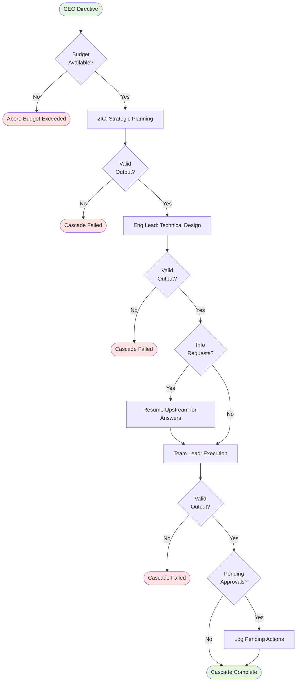

<p align="center">
  <h1 align="center">Echelon</h1>
  <p align="center">
    <strong>A hierarchical multi-agent AI orchestrator that turns a single directive into a full engineering org.</strong>
  </p>
  <p align="center">
    <a href="#installation">Installation</a> &middot;
    <a href="#quick-start">Quick Start</a> &middot;
    <a href="#how-it-works">How It Works</a> &middot;
    <a href="#configuration">Configuration</a> &middot;
    <a href="#cli-reference">CLI Reference</a> &middot;
    <a href="#documentation">Docs</a>
  </p>
</p>

---

You give a directive. Echelon builds the team, plans the work, creates GitHub issues, writes the code, opens PRs, and asks you to approve along the way.

```
CEO (you)
  "Build JWT auth with refresh tokens"
    └─ 2IC          → breaks directive into workstreams
        └─ Eng Lead  → designs architecture, defines tasks
            └─ Team Lead → creates GitHub issues, invokes engineers
                └─ Engineers (parallel) → write code, open PRs
```

No agents to configure. No prompt chains to debug. One command.

## What It Does

- **Hierarchical planning** &mdash; A directive cascades through AI management layers (2IC &rarr; Eng Lead &rarr; Team Lead) before any code is written. Each layer adds specificity.
- **Parallel code execution** &mdash; Engineers run in isolated git worktrees with a sliding-window scheduler. Three engineers by default, configurable.
- **GitHub-native** &mdash; Issues are created, branches are cut, PRs are opened and reviewed. Everything lives in your repo.
- **Human-in-the-loop** &mdash; Approval gates let you review destructive actions (issue creation, code execution) before they happen. Or go full auto.
- **Budget controls** &mdash; Per-layer and total spending limits. The system stops when the budget runs out, not when your wallet does.
- **Terminal UI** &mdash; Real-time org chart, activity feed, issue tracker, and cost dashboard. Or run headless for CI/automation.
- **Session persistence** &mdash; Save state, resume later. Agent context carries over via Claude session IDs.
- **Zero-config auto-discovery** &mdash; Just `cd` into any git repo and run `echelon`. It detects your project and gets you started.

## Prerequisites

| Tool | Required | Install |
|------|----------|---------|
| **Node.js** | v20+ | [nodejs.org](https://nodejs.org) |
| **Claude CLI** | Authenticated | `npm i -g @anthropic-ai/claude-code && claude login` |
| **GitHub CLI** | Authenticated | [cli.github.com](https://cli.github.com) &rarr; `gh auth login` |
| **Git** | Any recent version | [git-scm.com](https://git-scm.com) |

## Installation

```bash
# Clone the repo
git clone https://github.com/Venin-Client-Systems/echelon.git
cd echelon

# Install dependencies and build
npm install
npm run build

# Link globally (makes `echelon` available anywhere)
npm link
```

### Optional: Enable Shell Completion

Add tab completion for 10x faster command entry:

```bash
# Bash
source completions/echelon-completion.bash
echo "source $(pwd)/completions/echelon-completion.bash" >> ~/.bashrc

# Zsh
mkdir -p ~/.zsh/completions
cp completions/echelon-completion.zsh ~/.zsh/completions/_echelon
# Then add to ~/.zshrc and reload
```

See [docs/SHELL-COMPLETION.md](docs/SHELL-COMPLETION.md) for full instructions.

### Quick Reference

- **[Cheat Sheet](docs/CHEATSHEET.md)** - All commands on one page
- **[Testing Docs](docs/TESTING.md)** - Stress test results and quality assurance
- **[Shell Completion](docs/SHELL-COMPLETION.md)** - Tab completion setup

## Quick Start

### Just run it

Navigate to any git repo and run:

```bash
cd ~/projects/my-app
echelon
```

**First time?** Echelon auto-detects your git remote and offers a quick setup:

```
No config found. Detected: your-org/my-app
Run quick setup? [Y/n]

Approval mode [destructive/all/none] (destructive):

  ✓ Config written to /Users/you/projects/my-app/echelon.config.json
```

One question, one file, and the TUI launches immediately. That's it.

**Already set up?** Echelon finds your config automatically and launches the TUI. No flags needed.

### Headless mode

Run a directive without the TUI &mdash; great for CI, scripts, or quick one-offs:

```bash
echelon -d "Add input validation to all API endpoints" --headless
```

If no config exists, Echelon generates sensible defaults in-memory and runs immediately (no file written). You'll see a note to run `echelon init` to customize.

### Dry run

See what Echelon *would* do without any side effects:

```bash
echelon -d "Refactor auth into a service layer" --dry-run
```

### Full setup wizard

For fine-grained control over models, budgets, and safety settings:

```bash
echelon init
```

This walks you through:
- Prerequisite checks (Node, Git, Claude CLI, GitHub CLI)
- Project detection (auto-reads your git remote)
- Model selection per management layer
- Budget and safety configuration

### Explicit config path

For non-standard config locations or multi-project setups:

```bash
echelon --config ~/configs/my-project.json
```

## Common Commands

**The only command you need to remember:**
```bash
echelon              # Interactive mode - handles everything for you
```

**Other useful commands:**
```bash
echelon --help       # Show all available commands
echelon --version    # Show version number
echelon status       # Check current cascade state (alias: echelon s)
echelon --yolo       # Full autonomous mode (no approvals)

# Advanced usage
echelon -d "Your directive" --headless    # Non-interactive mode
echelon -d "Your directive" --dry-run     # Preview without executing
echelon init                              # Run full setup wizard
echelon sessions list                     # View all sessions
echelon sessions prune                    # Delete completed sessions
```

**Pro tip:** Run `echelon --help` anytime to see the full command reference with examples!

## Config Discovery

When you run `echelon` without `--config`, it searches for `echelon.config.json` in this order:

1. **Current directory** &mdash; `./echelon.config.json`
2. **Git root** &mdash; If you're in a subdirectory, checks the repo root
3. **Global config** &mdash; `~/.echelon/configs/<repo-name>.json`

If no config is found:

| Context | Behavior |
|---------|----------|
| **Interactive terminal** | Prompts to run quick setup (one question, writes config, launches TUI) |
| **Headless / non-TTY** | Generates in-memory defaults and runs (no file written) |
| **Not a git repo** | Prints error, suggests `--config` flag |

## How It Works

### The Cascade

```
Layer 0: CEO (Human)     ─── TUI input, approvals, overrides
Layer 1: 2IC (AI)        ─── Strategy, prioritization, workstream planning
Layer 2: Eng Lead (AI)   ─── Architecture, technical design, task breakdown
Layer 3: Team Lead (AI)  ─── Issue creation, sprint management, PR review
Layer 4: Engineers (AI)  ─── Code execution in parallel git worktrees
```



Each management layer (1-3) is a Claude Code headless session. They reason in natural language and emit structured JSON action blocks.

For detailed architecture diagrams including action lifecycle, scheduler state machine, and error handling flows, see [ARCHITECTURE.md](ARCHITECTURE.md).

```json
{
  "action": "create_issues",
  "issues": [
    {
      "title": "[Backend] JWT authentication with refresh tokens",
      "body": "## Overview\n...",
      "labels": ["backend", "ralphy-1"]
    }
  ]
}
```

Engineers (Layer 4) use [Cheenoski](https://github.com/Venin-Client-Systems/echelon/tree/main/cheenoski) &mdash; a parallel code execution engine that processes GitHub issues in isolated git worktrees, one branch per task, automatic PR creation.

### Approval Modes

| Mode | Behavior |
|------|----------|
| `destructive` (default) | CEO approves issue creation, code execution, and branch creation |
| `all` | CEO approves every action |
| `none` | Fully autonomous &mdash; no human approval required |

### Actions

| Action | Who | What |
|--------|-----|------|
| `update_plan` | 2IC, Eng Lead | Update strategic plan with workstreams |
| `create_issues` | Team Lead | Create GitHub issues via `gh` |
| `invoke_cheenoski` | Team Lead | Start parallel code execution |
| `create_branch` | Eng Lead | Cut a new git branch |
| `request_review` | Team Lead | Request PR review |
| `request_info` | Any layer | Ask another layer a question |
| `escalate` | Any layer | Bubble a decision to a higher layer |

## Configuration

`echelon.config.json`:

```json
{
  "project": {
    "repo": "owner/repo",
    "path": "/absolute/path/to/repo",
    "baseBranch": "main"
  },
  "layers": {
    "2ic":       { "model": "opus",   "maxBudgetUsd": 10.0, "maxTurns": 5 },
    "eng-lead":  { "model": "sonnet", "maxBudgetUsd": 5.0 },
    "team-lead": { "model": "sonnet", "maxBudgetUsd": 5.0 }
  },
  "engineers": {
    "engine": "claude",
    "fallbackEngines": ["opencode", "cursor"],
    "maxParallel": 3,
    "createPr": true,
    "prDraft": true,
    "projectBoard": {
      "projectNumber": 1,
      "statusField": "Status",
      "batchField": "Batch"
    }
  },
  "approvalMode": "destructive",
  "billing": "api",
  "maxTotalBudgetUsd": 50.0
}
```

All fields except `project.repo` and `project.path` have defaults. When auto-discovery generates an in-memory config, it uses:

| Field | Default |
|-------|---------|
| `layers.*.model` | `sonnet` |
| `layers.*.maxBudgetUsd` | `5.0` |
| `engineers.maxParallel` | `3` |
| `approvalMode` | `destructive` |
| `maxTotalBudgetUsd` | `50.0` |
| `baseBranch` | `main` |

### Models

| Model | Best For | Cost | Default Turns |
|-------|----------|------|---------------|
| `opus` | Strategy, complex reasoning (2IC) | $$$ | 5 |
| `sonnet` | Architecture, task breakdown (Eng Lead, Team Lead) | $$ | 8 |
| `haiku` | Fast iteration, simple tasks | $ | 12 |

Each layer's `maxTurns` can be overridden in the config. More turns = more file reading and reasoning, but higher cost.

### Approval Modes

Control when Echelon asks for your approval before executing actions:

| Mode | When to Approve | Use Case |
|------|----------------|----------|
| `destructive` | Issue creation, code execution, branch creation | **Recommended** — Safe default, prevents unwanted changes |
| `all` | Every action including queries | Max oversight, useful for learning how Echelon works |
| `none` | Never (auto-approve everything) | Fully autonomous, risky but fast |

**Example configs:**

```json
// Destructive mode (recommended) — Approve code changes, auto-approve queries
{
  "approvalMode": "destructive",
  "project": { "repo": "owner/repo", "path": "/path" }
}

// All mode — Approve everything (useful for testing)
{
  "approvalMode": "all",
  "project": { "repo": "owner/repo", "path": "/path" }
}

// None mode — Full autonomous (pair with budget limits!)
{
  "approvalMode": "none",
  "maxTotalBudgetUsd": 10.0,  // Safety net!
  "project": { "repo": "owner/repo", "path": "/path" }
}
```

**Override at runtime:**
```bash
echelon -d "Add tests" --approval-mode none --headless  # Full auto
echelon --yolo  # Alias for --approval-mode none (also skips permission prompts)
```

### Engineer Engines

Echelon engineers (Cheenoski) support multiple AI backends for code execution:

| Engine | Description | Best For |
|--------|-------------|----------|
| `claude` | Claude Code (default) | General purpose, highest quality |
| `opencode` | OpenAI Codex via Claude Code | Alternative backend |
| `codex` | Direct OpenAI Codex | Legacy support |
| `cursor` | Cursor AI | Editor-integrated workflows |
| `qwen` | Qwen Coder | Fast iteration, budget-conscious |

**Fallback engines** — Automatically retry failed tasks with different engines:

```json
{
  "engineers": {
    "engine": "claude",
    "fallbackEngines": ["opencode", "cursor"],  // Try these if claude fails
    "maxParallel": 3
  }
}
```

When an engineer fails (timeout, crash, no code changes), Cheenoski automatically retries with the next engine in the fallback list. Useful for:
- **Rate limits** — Switch to alternative backend when primary is throttled
- **Task-specific performance** — Some engines excel at certain domains
- **Cost optimization** — Try cheaper engines first, fallback to premium

**Engine selection happens per-task**, so different engineers can use different backends simultaneously.

### Billing Mode

Choose how Anthropic API usage is calculated:

```json
{
  "billing": "api"  // or "max"
}
```

- **`api`** (default) — Standard API pricing, pay-per-token. Recommended for most users.
- **`max`** — Claude Pro/Max plan. Lower concurrent request limits, but no per-token charges. Use if you have an active Max subscription.

**When to use `max` mode:**
- You have Claude Pro or Max plan
- Working on large projects (budget limits don't apply)
- Concerned about runaway API costs

**Trade-offs:**
- `max` mode has stricter rate limits (fewer concurrent agents)
- `api` mode has higher throughput but accumulates charges

## CLI Reference

```
Usage: echelon [options] [command]

Options:
  -c, --config <path>          Path to echelon.config.json (auto-discovered if omitted)
  -d, --directive <text>       CEO directive to execute
  --headless                   Run without TUI (headless mode)
  --dry-run                    Show planned cascade without executing
  --resume                     Resume the most recent session
  -v, --verbose                Enable debug logging
  --approval-mode <mode>       Override approval mode (destructive, all, none)
  --yolo                       Full autonomous mode — no approvals, no permission prompts
  --telegram                   Start in Telegram bot mode
  -V, --version                Output version number
  -h, --help                   Display help

Commands:
  run [options]                Run the orchestrator (default)
  init                         Interactive config generator (full wizard)
  sessions list                List all saved sessions
  sessions prune               Delete completed/failed sessions
  sessions delete <id>         Delete a specific session
```

### Common Workflows

```bash
# First time — auto-detects repo, quick setup, launches TUI
echelon

# Give a directive interactively via TUI
echelon

# Headless one-liner
echelon -d "Fix all TODO comments in src/" --headless

# Dry run to preview the cascade
echelon -d "Add rate limiting to API" --dry-run

# Full auto — no approval prompts
echelon -d "Add unit tests" --headless --approval-mode none

# Resume where you left off
echelon --resume

# Explicit config
echelon --config path/to/echelon.config.json

# Session management
echelon sessions list                    # List all saved sessions
echelon sessions prune                   # Delete completed/failed sessions
echelon sessions delete <session-id>     # Delete a specific session

# Telegram bot mode
echelon --telegram                       # Start as Telegram bot

# YOLO mode — full autonomous, no approvals
echelon -d "Fix bugs" --yolo --headless
```

### TUI Commands

Once inside the TUI, type these at the CEO prompt:

| Command | Description |
|---------|-------------|
| *free text* | Send a new directive to the 2IC |
| `/approve` | Approve all pending actions |
| `/reject [reason]` | Reject pending actions with optional reason |
| `/pause` | Pause the current cascade |
| `/status` | Show current org status |
| `/cost` | Show spending breakdown |
| `/quit` | Save state and exit |

## TUI Layout

```
┌─ Echelon ──────────────────────── project ────┐
│ ┌─ Org ──────────┐  ┌─ Feed ────────────────┐ │
│ │ CEO     ● you  │  │ [2IC] Breaking down.. │ │
│ │ 2IC     ◆ plan │  │ [Lead] JWT + refresh  │ │
│ │ Lead    ○ idle │  │ [TL] Created #42...   │ │
│ │ TL      ○ idle │  │ [Eng#1] Working #42   │ │
│ │ Eng #1  ▶ code │  │ [Eng#2] PR #12 open   │ │
│ └────────────────┘  └───────────────────────┘ │
│ ┌─ Issues ───────┐  Cost: $2.40 | Time: 8m   │
│ │ #42 JWT    ▶  │                             │
│ │ #43 RBAC   ○  │                             │
│ └────────────────┘                             │
│ CEO > _                                        │
└────────────────────────────────────────────────┘
```

## Telegram Bot Mode

Run Echelon as a Telegram bot for mobile-first operation:

```bash
echelon --telegram
```

### Setup

1. **Create a bot** via [@BotFather](https://t.me/BotFather):
   - Send `/newbot` and follow prompts
   - Save the bot token

2. **Get your chat ID**:
   - Message your bot
   - Visit `https://api.telegram.org/bot<YOUR_BOT_TOKEN>/getUpdates`
   - Find `"chat":{"id":123456789}` in the response

3. **Configure** via `echelon init` (Step 5) or add to `echelon.config.json`:

```json
{
  "telegram": {
    "token": "123456:ABC...",
    "chatId": "123456789",
    "allowedUserIds": [123456789],
    "health": {
      "enabled": true,
      "port": 3000,
      "bindAddress": "0.0.0.0"
    }
  }
}
```

### Environment Variables

Override config with environment variables (useful for production):

```bash
export ECHELON_TELEGRAM_BOT_TOKEN="123456:ABC..."
export ECHELON_TELEGRAM_CHAT_ID="123456789"
export ECHELON_TELEGRAM_ALLOWED_USERS="123456789,987654321"  # Comma-separated

# Health monitoring
export ECHELON_HEALTH_ENABLED="true"
export ECHELON_HEALTH_PORT="3000"
export ECHELON_HEALTH_BIND="0.0.0.0"
```

### Health Monitoring

Telegram bot mode includes an HTTP health check server (default port 3000):

```bash
curl http://localhost:3000/health
# {"status":"ok","uptime":120,"lastActivity":"2025-01-15T10:30:00Z"}
```

Useful for monitoring bot availability in production (Docker, systemd, etc.).

### Features

- **Mobile approval gates** — Approve/reject actions from your phone
- **Real-time progress** — Live updates from all layers and engineers
- **Health monitoring** — HTTP endpoint for uptime checks
- **User auth** — Only responds to configured user IDs
- **Async question handling** — CEO can ask you questions mid-cascade (5-minute timeout)

### Example Conversation

```
You: Add JWT authentication to the API

[CEO]: Starting cascade...
[2IC]: Breaking directive into workstreams:
       1. JWT token generation
       2. Refresh token flow
       3. Middleware integration
[Eng Lead]: Designed auth architecture
[Team Lead]: Created issues #42, #43, #44

⚠️ Approval needed: Create 3 GitHub issues?
[Approve] [Reject]

You: Approve

[Team Lead]: Issues created, starting Cheenoski...
[Eng#1]: Working on #42 (JWT generation)
[Eng#2]: Working on #43 (refresh flow)
[Eng#1]: PR #45 created for #42
...
```

## Session Persistence

Sessions are saved to `~/.echelon/sessions/<project-timestamp>/`:

- `state.json` &mdash; Full state (agent sessions, messages, issues, costs)
- `transcript.md` &mdash; Human-readable activity log

Resume your last session:

```bash
echelon --resume
```

Agent context carries over &mdash; Claude sessions are resumed with `claude -r <session-id>`, so the AI remembers what it was doing.

## Troubleshooting

### Common Errors

**"ANTHROPIC_API_KEY not set"**
```bash
export ANTHROPIC_API_KEY="sk-ant-..."  # Add to ~/.bashrc or ~/.zshrc
```

**"GITHUB_TOKEN not set or invalid"**
```bash
gh auth login  # Interactive auth
# OR
export GITHUB_TOKEN="ghp_..."  # Personal access token
```

**"Claude Code session not found"**
- Agent sessions expire after inactivity
- Start fresh: `echelon` (don't use `--resume`)
- Check `~/.echelon/sessions/` for orphaned state

**"Budget exceeded for layer: 2ic"**
- Each layer has a budget (`layers.2ic.maxBudgetUsd`)
- Increase in config or reduce task complexity
- Use `haiku` for simpler tasks (cheaper)

**"Action validation failed: Invalid action type"**
- Agent returned malformed JSON action block
- Check logs: `~/.echelon/logs/echelon-*.log`
- Usually means agent hit context limits (reduce task scope)

**Telegram bot not responding**
- Verify env vars: `ECHELON_TELEGRAM_BOT_TOKEN`, `ECHELON_TELEGRAM_CHAT_ID`
- Check bot token via `@BotFather`
- Verify chat ID: `curl https://api.telegram.org/bot<TOKEN>/getUpdates`
- Check `allowedUserIds` matches your Telegram user ID

**"gh: command not found"**
```bash
# macOS
brew install gh

# Linux
sudo apt install gh  # Debian/Ubuntu
sudo dnf install gh  # Fedora
```

**Engineers (Cheenoski) stuck on "Processing issue #42"**
- Check agent logs in worktree: `~/.echelon/worktrees/<branch>/`
- Hard timeout: 10 minutes (configurable: `engineers.hardTimeoutMs`)
- Kill stuck process: `pkill -f "claude.*issue-42"`

### Performance Tuning

**Slow cascade (>5 minutes for simple tasks)**
- Use `haiku` for lower layers (Eng Lead, Team Lead) — faster but less capable
- Reduce `maxTurns` for non-critical layers
- Use `--dry-run` to preview cascade before executing

**High API costs (>$5 for small features)**
- Switch expensive layers to `sonnet` instead of `opus`
- Set tighter per-layer budgets (`layers.2ic.maxBudgetUsd: 2.0`)
- Use `billing: "max"` if you have Claude Pro (no per-token charges, but lower limits)

**Engineers making no progress**
- Check issue descriptions — vague specs = poor results
- Ensure domain labels match (`[Backend]`, `[Frontend]`, etc.)
- Try different engine: `engineers.engine: "opencode"` or `"cursor"`

**Worktree conflicts**
```bash
# Clean up orphaned worktrees
git worktree list
git worktree remove <path>  # For each orphaned worktree
```

### Debug Mode

Enable verbose logging:
```bash
echelon -d "..." --verbose
```

Logs go to `~/.echelon/logs/echelon-<timestamp>.log`. Includes:
- Agent API calls and responses
- Action parsing (JSON extraction)
- Budget tracking
- Error stack traces

### Getting Help

- **Issues:** https://github.com/Venin-Client-Systems/echelon/issues
- **Docs:** [ARCHITECTURE.md](ARCHITECTURE.md), [SECURITY.md](SECURITY.md), [LOGGING.md](LOGGING.md)
- **Examples:** Check `examples/` directory for sample configs

## Architecture

```
src/
  index.ts                    # Entry point — auto-discovery, routes to TUI or headless
  cli.ts                      # Commander arg parsing
  commands/init.ts            # Setup wizard + quick init

  core/
    orchestrator.ts           # Main hierarchical cascade loop
    agent.ts                  # Claude Code session spawn/resume
    message-bus.ts            # EventEmitter routing between layers
    action-parser.ts          # Extract JSON action blocks from agent text
    action-executor.ts        # Execute or queue actions for approval
    state.ts                  # Persistent state load/save/resume
    session.ts                # Session management (list, prune, delete)

  actions/
    github-issues.ts          # gh issue create/update/close
    cheenoski.ts              # Invoke Cheenoski runner
    git.ts                    # Branch management
    review.ts                 # PR review

  ui/                         # Ink (React for CLI) components
    App.tsx                   # Root layout
    OrgChart.tsx              # Agent status sidebar
    Feed.tsx                  # Scrollable activity log
    IssuePanel.tsx            # GitHub issues tracker
    Input.tsx                 # CEO command input
    StatusBar.tsx             # Cost, time, project info
    ApprovalPrompt.tsx        # Inline approval UI
    hooks/useEchelon.ts       # Bridge orchestrator state to React

  lib/
    types.ts                  # Zod schemas for config, actions, state
    paths.ts                  # Atomic JSON writes
    logger.ts                 # Structured logging
    config.ts                 # Config loader, auto-discovery, default generation
    git-detect.ts             # Git remote/root/branch detection
    transcript.ts             # Markdown transcript writer
    prompts.ts                # System prompts for each layer

cheenoski/                    # Bundled parallel execution engine
```

## Documentation

### Guides

- **[ARCHITECTURE.md](ARCHITECTURE.md)** — Detailed system architecture, flow diagrams, and internals
- **[SECURITY.md](SECURITY.md)** — Security model, credential handling, and best practices
- **[LOGGING.md](LOGGING.md)** — Structured logging, debug mode, and log analysis

### API Reference

Generate API documentation locally:
```bash
npm run docs:api
```

The documentation covers:
- **Configuration** — `EchelonConfig`, `LayerConfig`, project settings
- **Core** — `Orchestrator`, `MessageBus`, agent lifecycle
- **Actions** — All action types and schemas
- **Types** — Complete type definitions and schemas

## Contributing

Issues and PRs are welcome. This is early-stage software &mdash; expect rough edges.

```bash
# Development
npm run dev -- -d "your directive" --headless

# Type checking
npm run typecheck

# Generate API docs
npm run docs:api
```

## License

[MIT](LICENSE) &copy; Venin Client Systems
