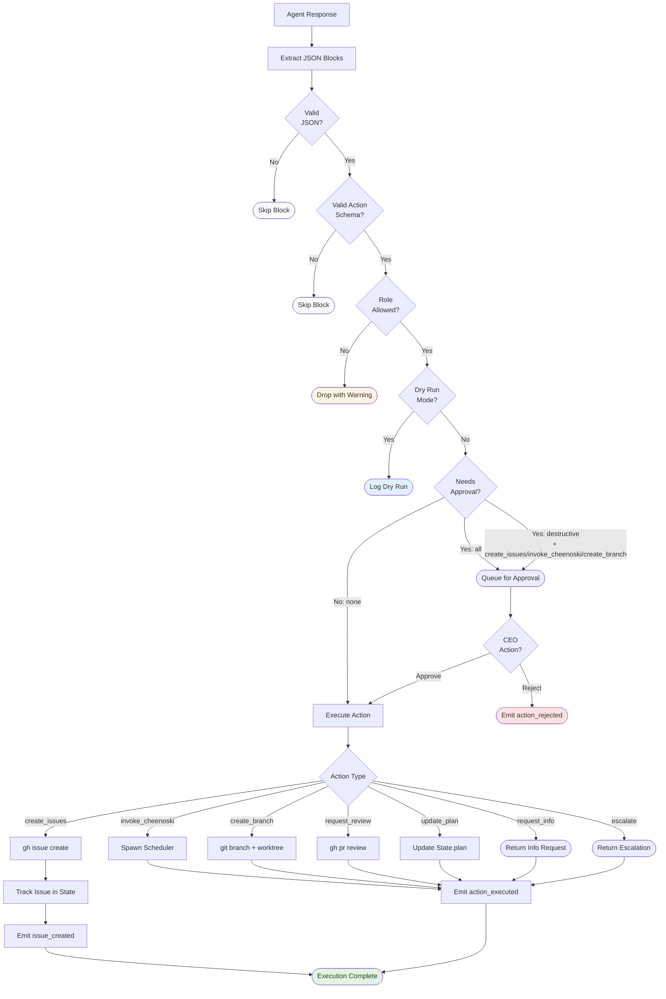

# Echelon Architecture

This document provides visual diagrams of Echelon's core architectural flows and state machines.

## Cascade Flow

The cascade is the main orchestration loop that flows directives through the management hierarchy:


**Key Decision Points:**

1. **Budget Checks** — Before each layer, verify both per-layer and total budget (skipped if `billing: 'max'`)
2. **Output Validation** — Ensure non-empty content and valid cost before proceeding downstream
3. **Info Request Loopback** — Layers can ask upstream questions, resuming sessions bidirectionally (max 2 rounds)
4. **Cascade Timeout** — Hard timeout (default 30min) to prevent infinite loops
5. **Pending Approvals** — Actions queue in `approvalMode: 'destructive'` or `'all'`

## Action Lifecycle

Every action block emitted by agents follows this execution flow:



**Key Decision Points:**

1. **JSON Parsing** — Regex extracts ` ```json ` blocks, invalid JSON silently skipped
2. **Schema Validation** — Zod discriminated union validates `action` field + parameters
3. **Role Filter** — 2IC/Eng Lead/Team Lead have specific allowed actions (e.g., Team Lead can't `update_plan`)
4. **Approval Mode**:
   - `none` — Auto-execute all
   - `destructive` — Queue `create_issues`, `invoke_cheenoski`, `create_branch`
   - `all` — Queue everything
5. **Dispatch** — Routes to specialized handlers in `src/actions/`

## Scheduler State Machine

The Cheenoski scheduler manages parallel code execution slots:


**Key Decision Points:**

1. **Slot Assignment** — Pick next issue compatible with running domains (parallel backend + frontend, serial database/infra)
2. **Loop Detection** — Skip issues closed/reopened multiple times
3. **In Progress Check** — Skip issues already assigned or labeled `WIP`
4. **Stuck Warning** — Warn at 120s, then every 60s
5. **Hard Timeout** — Kill engine at 600s (configurable), triggers retry
6. **Change Detection** — Tool use analysis + `git diff` fallback
7. **Merge Mutex** — Serial merges to prevent race conditions
8. **Retry Logic** — Up to `maxRetries` (default 2) on failure/stuck/merge conflict
9. **PR Creation** — Optional, draft mode supported

## Budget Flow

Budget checks happen at multiple levels:


**Budget enforcement is skipped when `billing: 'max'`** (unlimited Claude plan).

## Error Handling

Agent errors trigger cascading failure handling:

```mermaid
graph TD
    Error[Agent Error] --> Classify{Error Type}
    Classify -->|Rate Limit| Backoff[Exponential Backoff<br/>+ Retry]
    Classify -->|Timeout| Circuit{Circuit<br/>Breaker?}
    Classify -->|Crash| LogStack[Log Stack Trace]
    Classify -->|Quota| Stop([Abort Cascade])

    Circuit -->|Open<br/>(5+ failures)| Stop
    Circuit -->|Closed| Backoff

    LogStack --> MarkFailed[Mark Agent as 'error']
    MarkFailed --> SaveState[Save State]
    SaveState --> EmitError[Emit 'error' event]
    EmitError --> Abort([Cascade Failed])

    Backoff --> Retry{Retry<br/>Successful?}
    Retry -->|Yes| Continue([Continue Cascade])
    Retry -->|No| LogStack

    style Stop fill:#ffe1e1
    style Abort fill:#ffe1e1
    style Continue fill:#e1f5e1
```

**Error recovery** is built into `agent.ts` with exponential backoff, jitter, and circuit breaker pattern.

## State Persistence

All orchestrator state persists to `~/.echelon/sessions/<project-timestamp>/state.json`:

```json
{
  "sessionId": "echelon-owner-repo-20250115-103045",
  "status": "running" | "paused" | "completed" | "failed",
  "agents": {
    "2ic": { "sessionId": "claude-abc123", "totalCost": 0.05, ... },
    "eng-lead": { ... },
    "team-lead": { ... }
  },
  "messages": [ /* LayerMessage[] */ ],
  "issues": [ /* TrackedIssue[] */ ],
  "plan": "Strategic plan text",
  "totalCost": 0.15,
  "directive": "Original CEO directive",
  "startedAt": "2025-01-15T10:30:45Z"
}
```

**Session resumption** (`echelon --resume`) reloads state and resumes each agent via Claude session IDs.

## MessageBus Event Flow

All system events flow through the MessageBus (sync `EventEmitter`):


**Events** are defined in `src/lib/types.ts` as a discriminated union (`EchelonEvent`).

## Git Worktree Flow

Cheenoski uses isolated worktrees for parallel execution:


**Worktrees** are ephemeral — always cleaned up in `finally` blocks to prevent orphaned directories.

## Domain Parallelization

Issues are tagged with domain labels for smart parallelization:

| Domain | Parallel With | Serial With |
|--------|---------------|-------------|
| `backend` | `frontend`, `tests`, `docs` | `database`, `infrastructure` |
| `frontend` | `backend`, `tests`, `docs` | `database`, `infrastructure` |
| `database` | — | Everything (serial only) |
| `infrastructure` | — | Everything (serial only) |
| `security` | `tests`, `docs` | `backend`, `frontend`, `database`, `infrastructure` |
| `tests` | All except `database`, `infrastructure` | `database`, `infrastructure` |
| `docs` | All except `database`, `infrastructure` | `database`, `infrastructure` |

**Scheduler** checks `canRunParallel(domain1, domain2)` before filling slots.

## File References

- **Cascade**: `src/core/orchestrator.ts:86-225` (runCascade)
- **Action Lifecycle**: `src/core/action-parser.ts`, `src/core/action-executor.ts`
- **Scheduler**: `src/cheenoski/scheduler.ts:88-141` (run method)
- **State Machine**: `src/cheenoski/scheduler.ts:289-526` (runSlot)
- **Budget Checks**: `src/core/recovery.ts`
- **Domain Logic**: `src/cheenoski/domain.ts`
- **Git Worktrees**: `src/cheenoski/git/worktree.ts`
