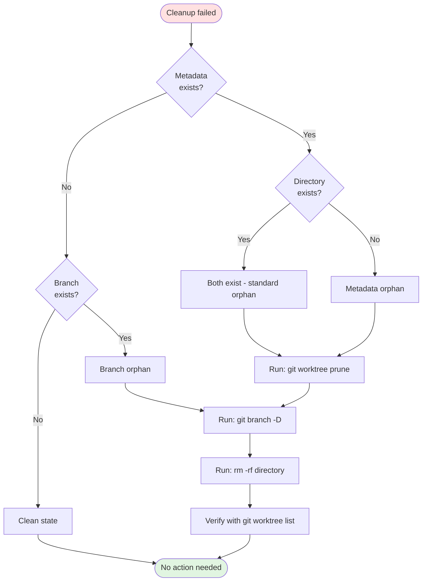

# Worktree Cleanup Architecture and Recovery

**Comprehensive guide to Cheenoski's worktree cleanup logic, failure patterns, and manual recovery procedures.**

---

## Table of Contents

- [Introduction](#introduction)
- [Why Worktree Cleanup is Critical](#why-worktree-cleanup-is-critical)
- [Architecture](#architecture)
  - [Three-Phase Cleanup Process](#three-phase-cleanup-process)
  - [Defensive Collision Detection](#defensive-collision-detection)
  - [Integration with Scheduler Retry Logic](#integration-with-scheduler-retry-logic)
- [Failure Modes](#failure-modes)
  - [Orphaned Metadata Symptoms](#orphaned-metadata-symptoms)
  - [Partial Cleanup Failures](#partial-cleanup-failures)
  - [Permission Errors](#permission-errors)
- [Manual Recovery Procedures](#manual-recovery-procedures)
- [Monitoring and Telemetry](#monitoring-and-telemetry)
- [Troubleshooting Guide](#troubleshooting-guide)
- [Related Documentation](#related-documentation)

---

## Introduction

Worktree cleanup is **critical** to Cheenoski's reliability. Without proper cleanup, git metadata orphans accumulate and block retries with errors like:

```
fatal: 'cheenoski-12345-42-jwt-auth' is already used by worktree at '/tmp/...'
```

This document explains:
1. **How** Cheenoski cleans up worktrees comprehensively
2. **When** cleanup happens (success vs. retry scenarios)
3. **What** goes wrong when cleanup fails
4. **How** to recover manually when auto-cleanup isn't enough

**Key source files:**
- [`src/cheenoski/git/worktree.ts`](../../src/cheenoski/git/worktree.ts) — Core cleanup functions
- [`src/cheenoski/scheduler.ts`](../../src/cheenoski/scheduler.ts) — Retry integration (line 539-557)

---

## Why Worktree Cleanup is Critical

### The Problem: Git Metadata Orphans

When you create a git worktree with `git worktree add`, git creates **two** things:

1. **Working directory** — `/tmp/cheenoski-worktrees/repo-branch/`
2. **Metadata directory** — `.git/worktrees/branch/`

The metadata directory tracks:
- Where the worktree's files live (`gitdir` file)
- Current commit (`HEAD` file)
- Connection back to main repo (`commondir` file)

**The trap:** If you delete the working directory with `rm -rf` but leave the metadata, git still thinks the worktree exists. The next `git worktree add` for that branch fails with:

```
fatal: 'branch-name' is already used by worktree at '/tmp/...'
```

This is **exactly** what happens when:
- A task fails and needs retry (same issue, new worktree attempt)
- Cheenoski crashes mid-cleanup (process killed, OOM, power loss)
- Manual cleanup removes directories but not metadata

### Why Standard Cleanup Isn't Enough for Retries

**Standard cleanup** (`removeWorktree()`) is designed for **successful** task completion:

```typescript
// src/cheenoski/git/worktree.ts:180-211
export async function removeWorktree(...) {
  await git(['worktree', 'remove', '--force', wtPath], repoPath);
  if (deleteBranch) {
    await git(['branch', '-D', branchName], repoPath);
  }
}
```

This works fine when:
- The worktree directory exists
- Git's internal state is consistent
- The task is done (won't retry)

**But retries need more:**
- Metadata may be orphaned (directory deleted, metadata lingers)
- Branch references may be stale
- Git's worktree list may be out of sync
- The next attempt needs a **clean slate**

That's why retries use `cleanupForRetry()` — a **comprehensive**, **idempotent** cleanup that prunes metadata, force-deletes branches, and removes directories in the correct order.

---

## Architecture

### Three-Phase Cleanup Process

**Function:** `cleanupForRetry(repoPath, worktreePath, branchName)`

**Source:** [`src/cheenoski/git/worktree.ts:138-174`](../../src/cheenoski/git/worktree.ts#L138-L174)

#### Phase 1: Prune Stale Metadata

```typescript
// Step 1: Prune stale worktree metadata
await pruneWorktreeMetadata(repoPath);
```

**What it does:**
- Runs `git worktree prune` to remove metadata for missing directories
- Git automatically detects `.git/worktrees/*/gitdir` entries pointing to non-existent paths
- Idempotent — safe to call even if metadata is already clean

**Why it's first:** Pruning before branch deletion prevents git from complaining about "worktree in use."

#### Phase 2: Verify Cleanup

```typescript
// Step 2: Verify no lingering worktree references
try {
  const output = await git(['worktree', 'list', '--porcelain'], repoPath);
  if (output.includes(branchName)) {
    logger.warn(`Worktree metadata still references ${branchName} after prune`);
  }
} catch (err) {
  logger.debug(`Could not verify worktree list: ${err.message}`);
}
```

**What it does:**
- Double-checks that the branch is no longer in git's worktree list
- Logs a warning if metadata persists (helps diagnose git bugs or filesystem issues)
- Non-fatal — continues cleanup even if verification fails

**Why it matters:** Catches edge cases where `prune` didn't clean everything (rare but possible with network filesystems or git bugs).

#### Phase 3: Force-Delete Branch and Directory

```typescript
// Step 3: Force-delete branch (ignore errors if doesn't exist)
try {
  await git(['branch', '-D', branchName], repoPath);
  logger.debug(`Force-deleted branch: ${branchName}`);
} catch (err) {
  logger.debug(`Branch deletion skipped (may not exist): ${branchName}`);
}

// Step 4: Remove filesystem directory
if (worktreePath) {
  try {
    await rm(worktreePath, { recursive: true, force: true });
    logger.debug(`Removed worktree directory: ${worktreePath}`);
  } catch (err) {
    logger.warn(`Failed to remove worktree directory: ${err.message}`);
  }
}
```

**What it does:**
- Uses `git branch -D` (capital D) to force-delete the branch
- Removes the filesystem directory with `rm -rf` equivalent
- Tolerates missing branches or directories (idempotency)

**Why force-delete?** Retry branches may have uncommitted changes. `-D` overrides git's safety checks.

**Why last?** Deleting the directory after pruning metadata ensures git can verify the worktree is gone before the filesystem evidence disappears.

---

### Defensive Collision Detection

**Function:** `createWorktree()` preemptively detects orphaned metadata before creation

**Source:** [`src/cheenoski/git/worktree.ts:53-72`](../../src/cheenoski/git/worktree.ts#L53-L72)

#### Detection Logic

```typescript
// Defensive check: detect orphaned worktree metadata before creation
const worktreeMetadataPath = join(repoPath, '.git', 'worktrees', branch);
if (existsSync(worktreeMetadataPath)) {
  logger.warn(`Detected orphaned worktree metadata for ${branch}, auto-cleaning`, {
    metric: 'worktree_orphan_cleanup',
    branch,
    metadataPath: worktreeMetadataPath,
  });

  try {
    await cleanupForRetry(repoPath, wtPath, branch);
    logger.info(`Auto-cleanup successful for ${branch}`);
  } catch (err) {
    throw new Error(
      `Failed to clean orphaned worktree metadata for ${branch}: ${err.message}. ` +
      `Manual cleanup required: rm -rf "${worktreeMetadataPath}"`
    );
  }
}
```

#### When This Helps

This defensive check catches orphans created by:

1. **Cheenoski crash** — Process killed mid-execution before cleanup finished
2. **Power loss** — System shutdown during task processing
3. **OOM kill** — Out-of-memory killer terminates Cheenoski
4. **Manual intervention** — User runs `rm -rf` on worktree directory
5. **Filesystem corruption** — Directory deleted but git state not updated

#### Additional Safety Check

```typescript
// Additional safety check: verify no active worktree references
try {
  const existingWorktrees = await git(['worktree', 'list', '--porcelain'], repoPath);
  if (existingWorktrees.includes(branch)) {
    logger.warn(`Detected existing worktree reference for ${branch}, cleaning before retry`);
    await cleanupForRetry(repoPath, wtPath, branch);
  }
} catch (err) {
  logger.debug(`Pre-creation worktree list check failed (non-fatal): ${err.message}`);
}
```

**Why two checks?**
- Filesystem check (`existsSync`) is fast but may miss active worktrees
- Git check (`worktree list`) is authoritative but slower
- Both together catch all orphan scenarios

---

### Integration with Scheduler Retry Logic

**Source:** [`src/cheenoski/scheduler.ts:539-557`](../../src/cheenoski/scheduler.ts#L539-L557)

#### When Cleanup Happens

The scheduler calls `cleanupSlotWorktree()` with different modes depending on task status:

```typescript
// src/cheenoski/scheduler.ts:505-513
finally {
  slot.finishedAt = new Date().toISOString();
  // Always cleanup worktree on attempt completion
  // Use comprehensive retry cleanup if not the final attempt
  const isRetry = attempt < maxRetries && slot.status !== 'done';
  await this.cleanupSlotWorktree(slot, isRetry);
  this.unregisterEngine(slot.id);
}
```

#### Cleanup Modes

```typescript
// src/cheenoski/scheduler.ts:539-557
private async cleanupSlotWorktree(slot: Slot, isRetry = false): Promise<void> {
  if (slot.worktreePath || slot.branchName) {
    try {
      if (isRetry) {
        // Use comprehensive cleanup for retry scenarios
        await cleanupForRetry(this.config.project.path, slot.worktreePath, slot.branchName);
      } else {
        // Use standard cleanup for success/final failure cases
        await removeWorktree(this.config.project.path, slot.worktreePath ?? '', slot.branchName, slot.issueNumber);
      }
    } catch (err) {
      logger.warn(`Failed to cleanup worktree: ${err.message}`);
    } finally {
      // Always clear the path reference even if removal failed
      slot.worktreePath = null;
    }
  }
}
```

**Decision logic:**

| Scenario | `isRetry` | Cleanup Function | Why |
|----------|-----------|------------------|-----|
| Task succeeded | `false` | `removeWorktree()` | Standard cleanup, branch kept for PR |
| Task failed (final attempt) | `false` | `removeWorktree()` | No retry, clean up normally |
| Task failed (will retry) | `true` | `cleanupForRetry()` | Comprehensive cleanup for clean slate |
| Scheduler stopped | `false` | `removeWorktree()` | Graceful shutdown, no retry |

**Why different cleanup?**
- **Success/final failure:** Branch may be preserved for PR or debugging
- **Retry:** Must guarantee clean slate — metadata orphans block retry

---

## Failure Modes

### Orphaned Metadata Symptoms

#### Error Message

```
fatal: 'cheenoski-12345-42-jwt-auth' is already used by worktree at '/tmp/cheenoski-worktrees/...'
```

#### Root Cause

Git metadata exists in `.git/worktrees/branch/` but the working directory was deleted:

```bash
# Metadata exists
$ ls .git/worktrees/cheenoski-12345-42-jwt-auth/
HEAD  commondir  gitdir

# But directory is gone
$ ls /tmp/cheenoski-worktrees/repo-cheenoski-12345-42-jwt-auth
ls: cannot access '...': No such file or directory
```

#### How It Happens

1. **Manual `rm -rf` cleanup** — User deletes directory without using git
2. **Crash during cleanup** — Process killed between directory removal and metadata prune
3. **Partial failure** — `rm -rf` succeeds but `git worktree prune` fails (permissions, git lock)
4. **Race condition** — Concurrent cleanup attempts step on each other

#### Detection

Cheenoski detects this in two places:

1. **Proactive (before retry):**
   ```typescript
   // src/cheenoski/git/worktree.ts:53-56
   const worktreeMetadataPath = join(repoPath, '.git', 'worktrees', branch);
   if (existsSync(worktreeMetadataPath)) {
     logger.warn(`Detected orphaned worktree metadata for ${branch}, auto-cleaning`);
   }
   ```

2. **Reactive (after git error):**
   ```typescript
   // Rollback on worktree creation failure
   catch (err) {
     if (err.message.includes('already used by worktree')) {
       // Auto-cleanup will trigger on next attempt via defensive check
     }
   }
   ```

#### Resolution

**Automatic:**
- Defensive check in `createWorktree()` runs `cleanupForRetry()` before retry
- Logged as `metric: 'worktree_orphan_cleanup'` for monitoring

**Manual (if auto-cleanup fails):**
See [Manual Recovery Procedures](#manual-recovery-procedures) below.

---

### Partial Cleanup Failures

#### Scenario 1: Branch Exists but Metadata Removed

**Symptom:** Git shows the branch but `git worktree list` doesn't include it:

```bash
$ git branch | grep cheenoski
  cheenoski-12345-42-jwt-auth

$ git worktree list | grep cheenoski
# No output
```

**Cause:**
- Metadata was pruned (via `git worktree prune`)
- Branch deletion failed (git lock, permissions)
- Cleanup stopped midway

**Impact:**
- Next retry creates a new branch name (with attempt suffix)
- Old branch lingers until manual cleanup
- Accumulation of orphaned branches over time

**Detection:**
```bash
# Find Cheenoski branches not in worktree list
git branch | grep cheenoski | while read branch; do
  if ! git worktree list | grep -q "$branch"; then
    echo "Orphaned branch: $branch"
  fi
done
```

**Recovery:**
```bash
# Safe to delete — branch is detached from worktree
git branch -D cheenoski-12345-42-jwt-auth
```

#### Scenario 2: Directory Exists but Metadata Removed

**Symptom:** Directory exists but git doesn't track it:

```bash
$ ls /tmp/cheenoski-worktrees/repo-cheenoski-12345-42-jwt-auth
# Files present

$ git worktree list | grep 42-jwt-auth
# No output
```

**Cause:**
- `git worktree prune` ran (metadata removed)
- Directory deletion failed (permissions, mount issues, open files)

**Impact:**
- Disk space leak (temp directory not cleaned)
- May cause "directory not empty" errors on retry

**Detection:**
```bash
# Find directories not in git's worktree list
for dir in /tmp/cheenoski-worktrees/*; do
  if ! git worktree list | grep -q "$(basename "$dir")"; then
    echo "Orphaned directory: $dir"
  fi
done
```

**Recovery:**
```bash
# Safe to delete — git doesn't track it
rm -rf /tmp/cheenoski-worktrees/repo-cheenoski-12345-42-jwt-auth
```

---

### Permission Errors

#### Scenario: Read-Only Filesystem or Directory

**Symptom:**
```
Failed to remove worktree directory: EACCES: permission denied, rmdir '/tmp/...'
```

**Causes:**
1. **Engineer process changes permissions** — `chmod 444` on files/directories
2. **Mount options** — Filesystem mounted read-only
3. **Running as wrong user** — Directory owned by different UID
4. **SELinux/AppArmor** — Security policies block deletion

**Impact:**
- Cleanup fails but continues (logged as warning)
- Directory remains on disk
- Retry may succeed (creates new directory with different name)

**Recovery:**
```bash
# Fix permissions recursively
chmod -R u+rwX /tmp/cheenoski-worktrees/repo-cheenoski-12345-42-jwt-auth

# Then retry cleanup
rm -rf /tmp/cheenoski-worktrees/repo-cheenoski-12345-42-jwt-auth
```

#### Scenario: `.git/worktrees/` Locked

**Symptom:**
```
Failed to prune worktree metadata: EBUSY: resource busy or locked
```

**Causes:**
1. **Concurrent git operation** — Another process has `.git/index.lock`
2. **Stale lock file** — Git crashed mid-operation, lock not released
3. **Filesystem lock** — NFS or network filesystem locking issue

**Detection:**
```bash
# Check for git lock files
find .git -name "*.lock" -type f
```

**Recovery:**
```bash
# Remove stale locks (ONLY if no git operations are running)
rm .git/index.lock
rm .git/worktrees/*/gitdir.lock

# Then retry prune
git worktree prune
```

**Warning:** Only remove `.lock` files if you're certain no git commands are running. Check with:
```bash
ps aux | grep -E 'git|claude'
```

---

## Manual Recovery Procedures

### Procedure 1: Complete Manual Cleanup

Use this when auto-cleanup fails completely and the worktree is stuck:

```bash
#!/bin/bash
# Complete manual worktree cleanup
# Usage: ./cleanup.sh <branch-name>

BRANCH="$1"
REPO_PATH="$(git rev-parse --show-toplevel)"

if [ -z "$BRANCH" ]; then
  echo "Usage: $0 <branch-name>"
  echo "Example: $0 cheenoski-12345-42-jwt-auth"
  exit 1
fi

echo "Cleaning up worktree for branch: $BRANCH"

# Step 1: Prune stale metadata
echo "Step 1: Pruning metadata..."
git worktree prune --verbose

# Step 2: Force-remove worktree (if git still tracks it)
echo "Step 2: Removing worktree..."
WORKTREE_PATH=$(git worktree list --porcelain | grep -A2 "$BRANCH" | grep "^worktree" | cut -d' ' -f2)
if [ -n "$WORKTREE_PATH" ]; then
  git worktree remove --force "$WORKTREE_PATH" 2>/dev/null || true
fi

# Step 3: Delete branch
echo "Step 3: Deleting branch..."
git branch -D "$BRANCH" 2>/dev/null || true

# Step 4: Remove metadata directory
echo "Step 4: Removing metadata..."
rm -rf "$REPO_PATH/.git/worktrees/$BRANCH"

# Step 5: Remove filesystem directory
echo "Step 5: Removing filesystem directory..."
find /tmp/cheenoski-worktrees -name "*$BRANCH*" -type d -exec rm -rf {} + 2>/dev/null || true

# Step 6: Verify cleanup
echo "Step 6: Verifying cleanup..."
if git worktree list | grep -q "$BRANCH"; then
  echo "WARNING: Worktree still in list"
fi

if git branch | grep -q "$BRANCH"; then
  echo "WARNING: Branch still exists"
fi

if [ -d "$REPO_PATH/.git/worktrees/$BRANCH" ]; then
  echo "WARNING: Metadata directory still exists"
fi

echo "Cleanup complete for $BRANCH"
```

**When to use:**
- Auto-cleanup failed with permission errors
- Manual intervention corrupted git state
- Multiple orphaned worktrees need batch cleanup

---

### Procedure 2: Bulk Cleanup of All Cheenoski Worktrees

Use this to clean up **all** Cheenoski worktrees at once (fresh start):

```bash
#!/bin/bash
# Bulk cleanup of all Cheenoski worktrees

REPO_PATH="$(git rev-parse --show-toplevel)"

echo "WARNING: This will delete ALL Cheenoski worktrees and branches"
read -p "Continue? (y/N) " -n 1 -r
echo
if [[ ! $REPLY =~ ^[Yy]$ ]]; then
  exit 1
fi

# Step 1: Prune all metadata
echo "Pruning all worktree metadata..."
git worktree prune --verbose

# Step 2: Remove all Cheenoski worktrees
echo "Removing all Cheenoski worktrees..."
git worktree list --porcelain | grep -B2 "cheenoski" | grep "^worktree" | cut -d' ' -f2 | while read wt; do
  echo "  Removing: $wt"
  git worktree remove --force "$wt" 2>/dev/null || rm -rf "$wt"
done

# Step 3: Delete all Cheenoski branches
echo "Deleting all Cheenoski branches..."
git branch | grep cheenoski | xargs -r git branch -D

# Step 4: Remove all metadata directories
echo "Removing metadata directories..."
rm -rf "$REPO_PATH/.git/worktrees/cheenoski-"*

# Step 5: Remove all filesystem directories
echo "Removing filesystem directories..."
rm -rf /tmp/cheenoski-worktrees/*

# Step 6: Verify cleanup
echo "Verification:"
echo "  Worktrees: $(git worktree list | grep -c cheenoski || echo 0)"
echo "  Branches:  $(git branch | grep -c cheenoski || echo 0)"
echo "  Metadata:  $(ls -d "$REPO_PATH/.git/worktrees/cheenoski-"* 2>/dev/null | wc -l)"
echo "  Temp dirs: $(ls /tmp/cheenoski-worktrees/ 2>/dev/null | wc -l)"
echo "Cleanup complete"
```

**When to use:**
- Testing/development — need clean slate
- Multiple failed tasks left orphaned worktrees
- Debugging cleanup issues

**Warning:** This deletes **all** Cheenoski work, including in-progress tasks.

---

### Procedure 3: Diagnose Cleanup Failure

Use this to understand **why** cleanup is failing:

```bash
#!/bin/bash
# Diagnose worktree cleanup issues
# Usage: ./diagnose.sh <branch-name>

BRANCH="$1"
REPO_PATH="$(git rev-parse --show-toplevel)"

if [ -z "$BRANCH" ]; then
  echo "Usage: $0 <branch-name>"
  exit 1
fi

echo "=== Diagnostic Report for $BRANCH ==="
echo

# Check 1: Git worktree list
echo "1. Git Worktree Status:"
if git worktree list | grep -q "$BRANCH"; then
  echo "   ✗ Branch is in git's worktree list"
  git worktree list --porcelain | grep -A5 "$BRANCH"
else
  echo "   ✓ Branch not in worktree list"
fi
echo

# Check 2: Branch existence
echo "2. Branch Status:"
if git branch | grep -q "$BRANCH"; then
  echo "   ✗ Branch exists"
  git show-ref --heads "$BRANCH"
else
  echo "   ✓ Branch does not exist"
fi
echo

# Check 3: Metadata directory
METADATA_PATH="$REPO_PATH/.git/worktrees/$BRANCH"
echo "3. Metadata Directory: $METADATA_PATH"
if [ -d "$METADATA_PATH" ]; then
  echo "   ✗ Metadata directory exists"
  ls -la "$METADATA_PATH"
  if [ -f "$METADATA_PATH/gitdir" ]; then
    echo "   gitdir points to: $(cat "$METADATA_PATH/gitdir")"
  fi
else
  echo "   ✓ Metadata directory does not exist"
fi
echo

# Check 4: Filesystem directory
echo "4. Filesystem Directories:"
FOUND=$(find /tmp/cheenoski-worktrees -name "*$BRANCH*" -type d 2>/dev/null)
if [ -n "$FOUND" ]; then
  echo "   ✗ Found directories:"
  echo "$FOUND" | while read dir; do
    echo "      $dir (size: $(du -sh "$dir" 2>/dev/null | cut -f1))"
    ls -ld "$dir"
  done
else
  echo "   ✓ No filesystem directories found"
fi
echo

# Check 5: Git locks
echo "5. Git Locks:"
LOCKS=$(find "$REPO_PATH/.git" -name "*.lock" 2>/dev/null)
if [ -n "$LOCKS" ]; then
  echo "   ✗ Lock files found:"
  echo "$LOCKS"
else
  echo "   ✓ No lock files"
fi
echo

# Check 6: Running processes
echo "6. Related Processes:"
PROCS=$(ps aux | grep -E "git|claude|cheenoski" | grep -v grep)
if [ -n "$PROCS" ]; then
  echo "$PROCS"
else
  echo "   ✓ No related processes running"
fi
echo

# Summary
echo "=== Recommended Action ==="
if git worktree list | grep -q "$BRANCH"; then
  echo "Run: git worktree remove --force <path>"
fi
if git branch | grep -q "$BRANCH"; then
  echo "Run: git branch -D $BRANCH"
fi
if [ -d "$METADATA_PATH" ]; then
  echo "Run: rm -rf $METADATA_PATH"
fi
if [ -n "$FOUND" ]; then
  echo "Run: rm -rf /tmp/cheenoski-worktrees/*$BRANCH*"
fi
if [ -n "$LOCKS" ]; then
  echo "WARNING: Git locks present — check for running operations first"
fi
```

**Output interpretation:**

- **✓ (checkmark)** — Component is clean
- **✗ (cross)** — Component needs cleanup
- **Recommended Action** — Commands to run for cleanup

---

## Monitoring and Telemetry

### Telemetry Counters

Cheenoski emits structured logs with metrics for monitoring cleanup operations:

#### Metric: `worktree_orphan_cleanup`

**Emitted when:** Orphaned metadata is detected and auto-cleaned before retry

**Log entry:**
```json
{
  "level": "warn",
  "msg": "Detected orphaned worktree metadata for cheenoski-12345-42-jwt-auth, auto-cleaning",
  "metric": "worktree_orphan_cleanup",
  "branch": "cheenoski-12345-42-jwt-auth",
  "metadataPath": "/path/to/repo/.git/worktrees/cheenoski-12345-42-jwt-auth"
}
```

**Why it matters:**
- Indicates Cheenoski is recovering from a previous crash
- High frequency suggests instability (crashes, OOM kills)
- Use to trigger alerts or auto-scaling

**Monitoring query (CloudWatch Logs Insights):**
```
fields @timestamp, branch, metadataPath
| filter metric = "worktree_orphan_cleanup"
| stats count() by bin(5m)
```

#### Metric: Cleanup Failures

**Emitted when:** Cleanup operations fail (warnings, not errors)

**Log entry:**
```json
{
  "level": "warn",
  "msg": "Failed to cleanup worktree: EACCES: permission denied",
  "component": "scheduler",
  "slot": 42,
  "issueNumber": 123
}
```

**Aggregation strategy:**
```
fields @timestamp, msg
| filter msg like /Failed to cleanup worktree/
| stats count() by bin(1h)
```

**Alert threshold:** More than 5 cleanup failures per hour suggests systemic issue (permissions, disk full).

---

### Dashboard Metrics

Recommended metrics for operational dashboards:

| Metric | Source | Query | Threshold |
|--------|--------|-------|-----------|
| **Orphan cleanup rate** | `worktree_orphan_cleanup` | Count per 5min | Alert if > 10/5min |
| **Cleanup failure rate** | `Failed to cleanup worktree` | Count per hour | Alert if > 5/hour |
| **Retry attempts** | `attempt` field in slot logs | Avg retries per task | Alert if avg > 1.5 |
| **Stale metadata age** | Manual script (see below) | Max age of `.git/worktrees/*` | Alert if > 24h |

#### Script: Check Stale Metadata Age

```bash
#!/bin/bash
# Check age of worktree metadata directories

REPO_PATH="$(git rev-parse --show-toplevel)"
MAX_AGE_HOURS=24

find "$REPO_PATH/.git/worktrees" -type d -name "cheenoski-*" | while read dir; do
  AGE_SECONDS=$(( $(date +%s) - $(stat -f %m "$dir" 2>/dev/null || stat -c %Y "$dir") ))
  AGE_HOURS=$(( AGE_SECONDS / 3600 ))

  if [ $AGE_HOURS -gt $MAX_AGE_HOURS ]; then
    echo "STALE: $dir (age: ${AGE_HOURS}h)"
  fi
done
```

**Interpretation:**
- Metadata older than 24 hours likely orphaned
- Run as cron job, alert if any stale metadata found

---

## Troubleshooting Guide

### Common Errors and Solutions

#### Error: "Already used by worktree"

**Full error:**
```
fatal: 'cheenoski-12345-42-jwt-auth' is already used by worktree at '/tmp/...'
```

**Diagnosis:**
```bash
# Check if metadata exists
ls .git/worktrees/cheenoski-12345-42-jwt-auth

# Check if directory exists
ls /tmp/cheenoski-worktrees/*cheenoski-12345-42-jwt-auth*
```

**Solution:**
```bash
# Let git prune stale metadata
git worktree prune --verbose

# If that doesn't work, manual cleanup
rm -rf .git/worktrees/cheenoski-12345-42-jwt-auth
git branch -D cheenoski-12345-42-jwt-auth
```

**Prevention:**
- Ensure `cleanupForRetry()` is called on all retry paths
- Use defensive check in `createWorktree()` (already implemented)

---

#### Error: "Cannot remove worktree: Permission denied"

**Full error:**
```
Failed to remove worktree directory: EACCES: permission denied, rmdir '/tmp/...'
```

**Diagnosis:**
```bash
# Check directory permissions
ls -ld /tmp/cheenoski-worktrees/repo-cheenoski-12345-42-jwt-auth

# Check file permissions inside
ls -la /tmp/cheenoski-worktrees/repo-cheenoski-12345-42-jwt-auth
```

**Solution:**
```bash
# Fix permissions recursively
chmod -R u+rwX /tmp/cheenoski-worktrees/repo-cheenoski-12345-42-jwt-auth

# Then retry cleanup
rm -rf /tmp/cheenoski-worktrees/repo-cheenoski-12345-42-jwt-auth
```

**Prevention:**
- Ensure engineer agents don't change file permissions
- Run Cheenoski with appropriate user/group ownership

---

#### Error: "Branch does not exist"

**Full error:**
```
error: branch 'cheenoski-12345-42-jwt-auth' not found
```

**Diagnosis:**
```bash
# List all branches
git branch -a | grep cheenoski

# Check if branch was already deleted
git reflog | grep cheenoski-12345-42-jwt-auth
```

**Solution:**
This is **expected** during idempotent cleanup. The error is caught and ignored:

```typescript
// src/cheenoski/git/worktree.ts:157-163
try {
  await git(['branch', '-D', branchName], repoPath);
} catch (err) {
  // Branch may not exist — this is expected on first retry
  logger.debug(`Branch deletion skipped (may not exist): ${branchName}`);
}
```

**No action needed** — cleanup continues normally.

---

#### Error: "Disk full" during cleanup

**Full error:**
```
ENOSPC: no space left on device, write '/tmp/...'
```

**Diagnosis:**
```bash
# Check disk usage
df -h /tmp

# Check Cheenoski worktree usage
du -sh /tmp/cheenoski-worktrees
```

**Solution:**
```bash
# Remove all Cheenoski worktrees
rm -rf /tmp/cheenoski-worktrees/*

# Or use bulk cleanup script from Procedure 2
```

**Prevention:**
- Monitor `/tmp` disk usage
- Configure cleanup cron job to remove old worktrees
- Use dedicated disk partition for `/tmp` with adequate space

---

### Debug Checklist

When cleanup fails, check these in order:

- [ ] **Git metadata exists?** — `ls .git/worktrees/`
- [ ] **Branch exists?** — `git branch | grep cheenoski`
- [ ] **Directory exists?** — `ls /tmp/cheenoski-worktrees/`
- [ ] **Permissions correct?** — `ls -ld /tmp/cheenoski-worktrees/*`
- [ ] **Git locks present?** — `find .git -name "*.lock"`
- [ ] **Disk space available?** — `df -h /tmp`
- [ ] **Processes holding files?** — `lsof +D /tmp/cheenoski-worktrees/`
- [ ] **Recent logs show errors?** — `grep "cleanup" ~/.echelon/logs/*.log`

Run the diagnostic script (Procedure 3) for automated checking.

---

## Related Documentation

- **[Worktree Lifecycle](../development/worktree-lifecycle.md)** — Complete lifecycle from creation to cleanup
- **[Error Recovery Guide](../guides/error-recovery.md)** — General error handling patterns
- **[Worktree Source Code](../../src/cheenoski/git/worktree.ts)** — Implementation details
- **[Scheduler Source Code](../../src/cheenoski/scheduler.ts)** — Retry integration

---

## Summary

Worktree cleanup is **critical** for Cheenoski reliability. Key takeaways:

### ✅ Best Practices

1. **Always use `cleanupForRetry()` for retries** — Standard cleanup leaves metadata orphans
2. **Leverage defensive checks** — `createWorktree()` auto-cleans orphaned metadata
3. **Monitor telemetry** — Track `worktree_orphan_cleanup` metric for crash detection
4. **Test cleanup paths** — Simulate crashes, verify recovery
5. **Use manual recovery scripts** — Keep diagnostic and cleanup scripts handy

### 🔍 Diagnostic Flow



### 🛠️ Quick Reference

**Cleanup functions:**
- `cleanupForRetry()` — Comprehensive (retries)
- `removeWorktree()` — Standard (success/final failure)
- `pruneWorktreeMetadata()` — Metadata only

**When to use which:**
- **Retry scenario** → `cleanupForRetry()`
- **Task succeeded** → `removeWorktree()` (keeps branch for PR)
- **Final failure** → `removeWorktree()` (cleans everything)
- **Manual recovery** → See Procedures 1-3 above

**Failure recovery:**
1. Check diagnostic output (Procedure 3)
2. Run targeted cleanup (Procedure 1)
3. If all else fails, bulk cleanup (Procedure 2)

For implementation details, see:
- [`src/cheenoski/git/worktree.ts:138-174`](../../src/cheenoski/git/worktree.ts#L138-L174) — `cleanupForRetry()` implementation
- [`src/cheenoski/scheduler.ts:539-557`](../../src/cheenoski/scheduler.ts#L539-L557) — Scheduler integration
