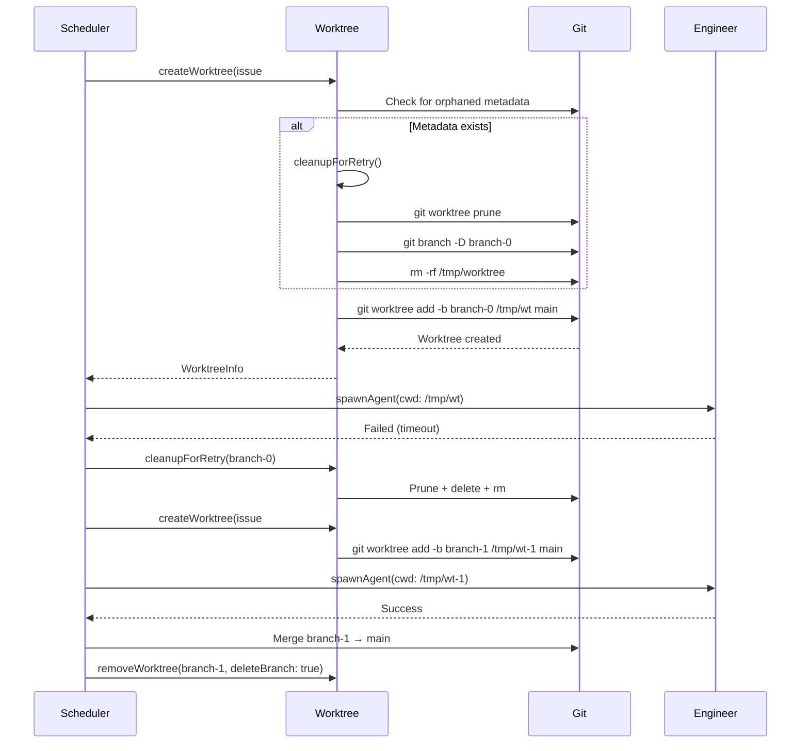

# Worktree Lifecycle in Cheenoski

Comprehensive developer guide to understanding and working with Cheenoski's worktree lifecycle, cleanup strategies, and common pitfalls.

---

## Table of Contents

- [Introduction](#introduction)
- [Why Worktrees?](#why-worktrees)
- [Lifecycle Stages](#lifecycle-stages)
  - [1. Creation](#1-creation)
  - [2. Execution](#2-execution)
  - [3. Merge](#3-merge)
  - [4. Cleanup](#4-cleanup)
  - [5. Retry](#5-retry)
- [Retry Mechanism Deep Dive](#retry-mechanism-deep-dive)
- [Common Pitfalls](#common-pitfalls)
- [Debugging Guide](#debugging-guide)
- [Testing Worktree Code](#testing-worktree-code)
- [Related Documentation](#related-documentation)

---

## Introduction

Cheenoski uses **git worktrees** to execute multiple GitHub issues in parallel, each in an isolated working directory. This approach provides:

- **Isolation:** Each engineer agent works in a clean sandbox without affecting other tasks
- **Parallelization:** Multiple issues can be worked on simultaneously without conflicts
- **Safety:** Failed tasks can be retried without contaminating the main repository

This document explains how worktrees are created, managed, cleaned up, and retried when failures occur.

**Key source files:**
- [`src/cheenoski/git/worktree.ts`](../../src/cheenoski/git/worktree.ts) — Core worktree operations
- [`src/cheenoski/git/branch-ledger.ts`](../../src/cheenoski/git/branch-ledger.ts) — Audit trail for branch/worktree actions
- [`src/cheenoski/git/merge.ts`](../../src/cheenoski/git/merge.ts) — Merge and cleanup coordination
- [`src/cheenoski/cleanup.ts`](../../src/cheenoski/cleanup.ts) — Orphaned process reaping

---

## Why Worktrees?

### Traditional Approach (Problematic)

```bash
git checkout -b feature-branch
# Engineer works here...
# Meanwhile, another engineer needs to work — blocked!
git checkout main
git checkout -b another-feature
# Previous work is now inaccessible
```

**Problems:**
- Only one branch can be active at a time
- Switching branches stalls parallel work
- Uncommitted changes get lost or contaminate other branches

### Worktree Approach (Cheenoski)

```bash
# Main repo stays on 'main' branch
/path/to/repo (main)

# Worktree 1: Issue #42
/tmp/cheenoski-worktrees/repo-12345-cheenoski-12345-42-jwt-auth (cheenoski-12345-42-jwt-auth)

# Worktree 2: Issue #43 (running in parallel)
/tmp/cheenoski-worktrees/repo-12345-cheenoski-12345-43-rate-limiting (cheenoski-12345-43-rate-limiting)
```

**Benefits:**
- ✅ Each issue gets a dedicated working directory
- ✅ Parallel execution without checkout conflicts
- ✅ Clean isolation — no cross-contamination
- ✅ Main repo remains on stable branch
- ✅ Easy cleanup after completion

---

## Lifecycle Stages

### 1. Creation

**Function:** `createWorktree(repoPath, baseBranch, issueNumber, slug)`

**Source:** [`src/cheenoski/git/worktree.ts:44-116`](../../src/cheenoski/git/worktree.ts#L44-L116)

#### Branch Naming

Cheenoski generates unique, collision-resistant branch names:

```typescript
// Pattern: cheenoski-<PID>-<issue>-<slug>
export function worktreeBranchName(issueNumber: number, slug: string): string {
  const safeslug = slug.replace(/[^a-zA-Z0-9_-]/g, '-');
  return `cheenoski-${process.pid}-${issueNumber}-${safeslug}`;
}
```

**Why PID?** Prevents collisions when multiple Cheenoski instances run the same issue in parallel.

**Example:**
```
cheenoski-54321-42-add-jwt-authentication
└─ PID ─┘ └issue┘ └─────── slug ──────┘
```

#### Path Generation

Worktrees are created in a temp-adjacent location:

```typescript
export function worktreePath(repoPath: string, branchName: string): string {
  const repoName = basename(repoPath) || 'repo';
  const safeRepoName = repoName.replace(/[^a-zA-Z0-9_-]/g, '-');
  const safeBranchName = branchName.replace(/[^a-zA-Z0-9_-]/g, '-');

  // Include PID to prevent path collisions
  return join(tmpdir(), 'cheenoski-worktrees', `${safeRepoName}-${process.pid}-${safeBranchName}`);
}
```

**Example path:**
```
/tmp/cheenoski-worktrees/echelon-54321-cheenoski-54321-42-add-jwt-authentication
```

#### Creation Steps

```typescript
// Step 1: Defensive check — detect orphaned metadata
const worktreeMetadataPath = join(repoPath, '.git', 'worktrees', branch);
if (existsSync(worktreeMetadataPath)) {
  logger.warn(`Detected orphaned worktree metadata for ${branch}, auto-cleaning`);
  await cleanupForRetry(repoPath, wtPath, branch);
}

// Step 2: Additional safety check — verify no active worktree references
const existingWorktrees = await git(['worktree', 'list', '--porcelain'], repoPath);
if (existingWorktrees.includes(branch)) {
  await cleanupForRetry(repoPath, wtPath, branch);
}

// Step 3: Create worktree with new branch from base
await git(['worktree', 'add', '-b', branch, wtPath, baseBranch], repoPath);

// Step 4: Record creation in audit ledger
appendToLedger({
  action: 'create',
  branch,
  worktree: wtPath,
  issueNumber,
  detail: `from ${baseBranch}`,
});
```

**Key safety features:**
- **Orphan detection:** Checks for stale git metadata before creation
- **Auto-cleanup:** Runs retry cleanup if metadata exists
- **Atomic rollback:** If creation fails partway, cleans up both worktree and branch
- **Audit trail:** All creations logged to `~/.cheenoski/branches/`

#### Rollback on Failure

```typescript
try {
  await git(['worktree', 'add', '-b', branch, wtPath, baseBranch], repoPath);
} catch (err) {
  // Rollback: remove worktree and branch if partially created
  if (existsSync(wtPath)) {
    await git(['worktree', 'remove', '--force', wtPath], repoPath);
  }

  try {
    await git(['rev-parse', '--verify', branch], repoPath);
    await git(['branch', '-D', branch], repoPath);
  } catch { /* branch didn't exist */ }

  throw new Error(`Failed to create worktree: ${err.message}`);
}
```

---

### 2. Execution

**Function:** Engineer agent spawns and works in the worktree

**Source:** [`src/cheenoski/index.ts`](../../src/cheenoski/index.ts) (scheduler and execution logic)

#### Engineer Agent Workflow

```typescript
// Engineer spawns with worktree as cwd
const response = await spawnAgent(
  issueBody,
  {
    model: engineerConfig.model,
    maxBudgetUsd: engineerConfig.maxBudgetUsd,
    systemPrompt: buildSystemPrompt(issue, task),
    cwd: worktree.path,  // Engineer works here
    yolo: engineerConfig.yolo,
  }
);
```

**What happens in the worktree:**
- Engineer reads/writes files in isolated directory
- Git operations affect only this worktree's branch
- Untracked files, builds, and test outputs stay isolated
- Main repository remains untouched

#### Concurrent Safety

Worktrees enable safe parallelization:

```
┌─────────────────────────────────────────┐
│ Main Repo: /path/to/echelon (main)     │
└─────────────────────────────────────────┘
           ↓ spawns
     ┌─────┴─────┬──────────────┐
     ↓           ↓              ↓
  WT #42      WT #43        WT #44
  [Backend]   [Frontend]    [Tests]
  ───────────────────────────────────
  No conflicts — each has own .git/worktrees/ metadata
```

---

### 3. Merge

**Function:** Merge completed work back to base branch

**Source:** [`src/cheenoski/git/merge.ts`](../../src/cheenoski/git/merge.ts)

#### Merge Process

```typescript
// After engineer completes task:
// 1. Switch to base branch in main repo
await git(['checkout', baseBranch], repoPath);

// 2. Merge worktree branch
await git(['merge', '--no-ff', branchName, '-m', commitMsg], repoPath);

// 3. Push to remote
await git(['push', 'origin', baseBranch], repoPath);
```

**Merge strategy:**
- Uses `--no-ff` to preserve branch history
- Commit message includes issue reference
- Pushes immediately after merge

**Conflict handling:**
```typescript
try {
  await git(['merge', '--no-ff', branchName], repoPath);
} catch (err) {
  if (err.message.includes('CONFLICT')) {
    logger.error('Merge conflict detected');
    // Abort merge and report failure
    await git(['merge', '--abort'], repoPath);
    throw new Error(`Cannot auto-merge #${issue.number}: conflicts detected`);
  }
}
```

---

### 4. Cleanup

**Function:** `removeWorktree(repoPath, wtPath, branchName, issueNumber, deleteBranch)`

**Source:** [`src/cheenoski/git/worktree.ts:177-211`](../../src/cheenoski/git/worktree.ts#L177-L211)

#### Standard Cleanup (Success)

```typescript
// Step 1: Remove worktree directory
if (existsSync(wtPath)) {
  await git(['worktree', 'remove', '--force', wtPath], repoPath);
}

// Step 2: Delete branch (if not creating PR)
if (deleteBranch) {
  await git(['branch', '-D', branchName], repoPath);
  appendToLedger({
    action: 'delete',
    branch: branchName,
    worktree: wtPath,
    issueNumber,
    detail: 'cleanup after removal',
  });
}
```

**When to keep the branch:**
- Creating a pull request (branch needed for PR reference)
- Manual review requested
- Failed merge (preserve for debugging)

**When to delete the branch:**
- Successfully merged to base
- Task abandoned
- Retry scenario (see next section)

---

### 5. Retry

**Function:** `cleanupForRetry(repoPath, worktreePath, branchName)`

**Source:** [`src/cheenoski/git/worktree.ts:133-174`](../../src/cheenoski/git/worktree.ts#L133-L174)

#### Why Retry Needs Special Cleanup

When a task fails and needs retry, **standard cleanup is insufficient** because:

1. **Git metadata persists** — `.git/worktrees/<branch>` survives directory removal
2. **Branch references linger** — Git still thinks the worktree exists
3. **Race conditions** — Concurrent retries may see stale state

Without proper cleanup, the next `createWorktree()` call fails with:

```
fatal: 'cheenoski-12345-42-jwt-auth' is already used by worktree at '/tmp/...'
```

#### Retry Cleanup Sequence

```typescript
export async function cleanupForRetry(
  repoPath: string,
  worktreePath: string | null,
  branchName: string,
): Promise<void> {
  // Step 1: Prune stale worktree metadata
  await pruneWorktreeMetadata(repoPath);

  // Step 2: Verify no lingering worktree references
  const output = await git(['worktree', 'list', '--porcelain'], repoPath);
  if (output.includes(branchName)) {
    logger.warn(`Worktree metadata still references ${branchName} after prune`);
  }

  // Step 3: Force-delete branch (ignore errors if doesn't exist)
  try {
    await git(['branch', '-D', branchName], repoPath);
  } catch { /* branch may not exist — expected on first retry */ }

  // Step 4: Remove filesystem directory
  if (worktreePath) {
    await rm(worktreePath, { recursive: true, force: true });
  }
}
```

**Key insight:** The order matters. Pruning metadata *before* deleting the branch prevents git from complaining about "worktree in use."

#### Idempotency

`cleanupForRetry()` is **idempotent** — safe to call multiple times:

```typescript
await cleanupForRetry(repo, wtPath, branch); // First call
await cleanupForRetry(repo, wtPath, branch); // Safe — no-op
await cleanupForRetry(repo, wtPath, branch); // Still safe
```

**Why idempotency matters:**
- Concurrent cleanup attempts don't conflict
- Defensive checks can call cleanup preemptively
- Crash recovery can re-run cleanup without side effects

---

## Retry Mechanism Deep Dive

### When Retries Occur

Cheenoski retries tasks in these scenarios:

1. **Engineer agent crashes** (process exit, timeout)
2. **Merge conflict** detected
3. **Tests fail** after implementation
4. **Budget exceeded** mid-execution
5. **Manual retry** requested by user

**Source:** Retry logic in [`src/cheenoski/scheduler.ts`](../../src/cheenoski/scheduler.ts)

### Branch Naming with Attempts

Retry branches use an attempt suffix:

```
cheenoski-54321-42-jwt-auth-0   ← First attempt
cheenoski-54321-42-jwt-auth-1   ← First retry
cheenoski-54321-42-jwt-auth-2   ← Second retry
```

**Implementation:**
```typescript
function retryBranchName(originalBranch: string, attemptNumber: number): string {
  return `${originalBranch}-${attemptNumber}`;
}
```

### Retry Flow Diagram



### Defensive Orphan Detection

**Problem:** If Cheenoski crashes before cleanup, git metadata orphans persist.

**Solution:** Proactive detection in `createWorktree()`:

```typescript
// src/cheenoski/git/worktree.ts:53-72
const worktreeMetadataPath = join(repoPath, '.git', 'worktrees', branch);
if (existsSync(worktreeMetadataPath)) {
  logger.warn(`Detected orphaned worktree metadata for ${branch}, auto-cleaning`, {
    metric: 'worktree_orphan_cleanup',
    branch,
    metadataPath: worktreeMetadataPath,
  });

  try {
    await cleanupForRetry(repoPath, wtPath, branch);
    logger.info(`Auto-cleanup successful for ${branch}`);
  } catch (err) {
    throw new Error(
      `Failed to clean orphaned worktree metadata for ${branch}: ${err.message}. ` +
      `Manual cleanup required: rm -rf "${worktreeMetadataPath}"`
    );
  }
}
```

**When this helps:**
- Cheenoski killed mid-execution (SIGKILL, OOM)
- Power loss during task processing
- Forced termination before cleanup finishes

**Metric tracking:** Logs `worktree_orphan_cleanup` metric for monitoring.

---

## Common Pitfalls

### 1. "Already used by worktree" Error

**Error message:**
```
fatal: 'cheenoski-12345-42-jwt-auth' is already used by worktree at '/tmp/cheenoski-worktrees/...'
```

**Cause:** Git metadata exists in `.git/worktrees/` but the worktree directory was deleted.

**Fix:**
```bash
# Manual cleanup
git worktree prune
git branch -D cheenoski-12345-42-jwt-auth

# Or let Cheenoski auto-detect (defensive check in createWorktree)
```

**Prevention:** Always use `cleanupForRetry()` instead of manual `rm -rf`.

**Code example:**
```typescript
// ❌ Wrong (leaves metadata orphaned)
await rm(worktreePath, { recursive: true });

// ✅ Correct (cleans metadata + directory)
await cleanupForRetry(repoPath, worktreePath, branchName);
```

---

### 2. Orphaned Worktrees

**Symptom:** `git worktree list` shows worktrees but directories don't exist:

```bash
$ git worktree list --porcelain
worktree /tmp/cheenoski-worktrees/echelon-12345-cheenoski-12345-42-jwt-auth
HEAD abc123...
branch refs/heads/cheenoski-12345-42-jwt-auth

# But directory is missing:
$ ls /tmp/cheenoski-worktrees/echelon-12345-cheenoski-12345-42-jwt-auth
ls: cannot access '...': No such file or directory
```

**Cause:**
- Filesystem cleanup without git cleanup
- Process crash mid-cleanup
- Manual `rm -rf` of worktree directory

**Detection:**
```typescript
export async function listWorktrees(repoPath: string): Promise<WorktreeInfo[]> {
  const output = await git(['worktree', 'list', '--porcelain'], repoPath);
  const blocks = output.split('\n\n').filter(Boolean);

  for (const block of blocks) {
    const worktreeLine = lines.find(l => l.startsWith('worktree '));
    const path = worktreeLine.replace('worktree ', '');

    if (!existsSync(path)) {
      logger.warn(`Orphaned worktree detected: ${path}`);
    }
  }
}
```

**Fix:**
```bash
# Prune all stale metadata
git worktree prune

# Verify cleanup
git worktree list
# Should only show existing directories
```

**Prevention:** Use `cleanupForRetry()` which calls `pruneWorktreeMetadata()`.

---

### 3. Concurrent Cleanup Issues

**Symptom:** Race conditions when multiple cleanup attempts happen simultaneously.

**Cause:** Parallel retries or crash recovery attempts cleaning the same worktree.

**Solution:** Merge mutex in `merge.ts`:

```typescript
// src/cheenoski/git/merge.ts
const mergeMutex = new Map<string, Promise<void>>();

export async function mergeWithCleanup(
  repoPath: string,
  branch: string,
  issue: number,
): Promise<void> {
  const key = `${repoPath}:${branch}`;

  // Wait for any in-flight merge of the same branch
  if (mergeMutex.has(key)) {
    await mergeMutex.get(key);
    return;
  }

  const promise = (async () => {
    try {
      await doMerge(repoPath, branch);
      await cleanupForRetry(repoPath, null, branch);
    } finally {
      mergeMutex.delete(key);
    }
  })();

  mergeMutex.set(key, promise);
  await promise;
}
```

**How it helps:**
- First cleanup attempt locks the mutex
- Concurrent attempts wait for completion
- Prevents "branch does not exist" errors from double-delete

---

### 4. Orphaned Child Processes

**Symptom:** Engineer spawns long-running processes (tsc --watch, vitest) that outlive the worktree.

**Cause:** Engineer agent crashes before cleaning up child processes.

**Detection:**
```bash
# Find orphaned processes in worktree directories
ps aux | grep -E '/tmp/cheenoski-worktrees/.*/(tsc|vitest|jest)'
```

**Solution:** Automatic reaping in `cleanup.ts`:

```typescript
// src/cheenoski/cleanup.ts:25-97
export async function reapOrphanedProcesses(): Promise<number> {
  const ORPHAN_PATTERNS = [
    /tsc.*--watch/,
    /vitest.*run/,
    /jest.*--runInBand/,
  ];

  // Find processes matching patterns
  const { stdout } = await execFileAsync('ps', ['aux']);

  for (const process of parseProcessList(stdout)) {
    if (!ORPHAN_PATTERNS.some(pattern => pattern.test(process.command))) {
      continue;
    }

    // Verify process is running in a Cheenoski worktree
    const cwd = await getProcessCwd(process.pid);
    if (!cwd.startsWith('/tmp/cheenoski-worktrees/')) {
      continue;
    }

    // Kill orphaned process
    process.kill(process.pid, 'SIGTERM');
    await sleep(500);

    // Escalate to SIGKILL if still alive
    if (isAlive(process.pid)) {
      process.kill(process.pid, 'SIGKILL');
    }
  }
}
```

**When it runs:** Automatically during Cheenoski shutdown.

**Prevention:** Engineer agents should always cleanup child processes in `finally` blocks.

---

### 5. Stale Branch References After Merge

**Symptom:** Branch shows in `git branch` but was already merged.

**Cause:** Cleanup skipped after successful merge.

**Fix:**
```bash
# Delete merged branches
git branch --merged main | grep cheenoski | xargs git branch -d
```

**Prevention:** Set `deleteBranch: true` in `removeWorktree()` after merge:

```typescript
// After successful merge
await removeWorktree(repoPath, wtPath, branch, issueNumber, deleteBranch: true);
```

---

## Debugging Guide

### Inspect Active Worktrees

```bash
# List all worktrees with details
git worktree list --porcelain

# Output:
# worktree /tmp/cheenoski-worktrees/echelon-12345-cheenoski-12345-42-jwt-auth
# HEAD abc123def456...
# branch refs/heads/cheenoski-12345-42-jwt-auth
#
# worktree /tmp/cheenoski-worktrees/echelon-12345-cheenoski-12345-43-rate-limiting
# HEAD 789012abc345...
# branch refs/heads/cheenoski-12345-43-rate-limiting
```

**Interpretation:**
- `worktree <path>` — Working directory location
- `HEAD <sha>` — Current commit
- `branch <ref>` — Branch name (if not detached)

### Check for Orphaned Directories

```bash
# Find worktree directories
ls -la /tmp/cheenoski-worktrees/

# Cross-reference with git's internal state
git worktree list | awk '{print $1}' | while read wt; do
  if [ ! -d "$wt" ]; then
    echo "Orphaned: $wt"
  fi
done
```

### Review Git Worktree Metadata

```bash
# Inspect git's internal worktree records
ls -la .git/worktrees/

# Each subdirectory is a worktree's metadata
# Example:
# .git/worktrees/cheenoski-12345-42-jwt-auth/
#   ├── gitdir       ← Points to worktree's .git file
#   ├── HEAD         ← Current commit
#   └── commondir    ← Points back to main .git

# Check if metadata matches reality
cat .git/worktrees/cheenoski-12345-42-jwt-auth/gitdir
# Should point to: /tmp/cheenoski-worktrees/.../. git

# If the path doesn't exist, metadata is stale
```

### Prune Stale Metadata

```bash
# Let git clean up stale metadata automatically
git worktree prune

# Verify cleanup
git worktree list
# Should only show worktrees with existing directories
```

**When to use:**
- After manual `rm -rf` of a worktree directory
- Before retrying a failed task
- After Cheenoski crashes mid-cleanup

### Detect Metadata-Directory Mismatches

```bash
# Script to find orphaned metadata or directories
#!/bin/bash

# Get all metadata entries
for meta in .git/worktrees/*; do
  branch=$(basename "$meta")
  gitdir=$(cat "$meta/gitdir" 2>/dev/null | sed 's/\/\.git$//')

  if [ ! -d "$gitdir" ]; then
    echo "Orphaned metadata: $branch (missing directory: $gitdir)"
  fi
done

# Get all worktree directories
for dir in /tmp/cheenoski-worktrees/*; do
  branch=$(basename "$dir" | sed 's/^.*-cheenoski-/cheenoski-/')

  if [ ! -d ".git/worktrees/$branch" ]; then
    echo "Orphaned directory: $dir (missing metadata: .git/worktrees/$branch)"
  fi
done
```

### Check Branch Ledger

```bash
# View audit trail for a specific branch
ls ~/.cheenoski/branches/

# Each file is a hash of the branch name
# Example: a1b2c3d4e5f6.ledger

# Read ledger entries
cat ~/.cheenoski/branches/a1b2c3d4e5f6.ledger | jq .

# Output:
# {"action":"create","branch":"cheenoski-12345-42-jwt-auth","worktree":"/tmp/...","issueNumber":42,"detail":"from main","timestamp":"2026-02-19T10:00:00.000Z","pid":12345}
# {"action":"delete","branch":"cheenoski-12345-42-jwt-auth","worktree":"/tmp/...","issueNumber":42,"detail":"cleanup after removal","timestamp":"2026-02-19T10:05:00.000Z","pid":12345}
```

**Ledger fields:**
- `action` — `create` | `delete` | `merge`
- `branch` — Full branch name
- `worktree` — Working directory path
- `issueNumber` — GitHub issue number
- `detail` — Contextual information
- `timestamp` — ISO 8601 timestamp
- `pid` — Process ID that created the entry

### Force Cleanup a Stuck Worktree

```bash
# Step 1: Prune metadata
git worktree prune

# Step 2: Force-remove worktree (if still stuck)
git worktree remove --force /tmp/cheenoski-worktrees/echelon-12345-cheenoski-12345-42-jwt-auth

# Step 3: Delete branch
git branch -D cheenoski-12345-42-jwt-auth

# Step 4: Remove filesystem directory
rm -rf /tmp/cheenoski-worktrees/echelon-12345-cheenoski-12345-42-jwt-auth

# Step 5: Verify cleanup
git worktree list
git branch | grep cheenoski
ls /tmp/cheenoski-worktrees/
```

### Debug Concurrent Worktree Collisions

**Symptom:** Two Cheenoski instances try to create the same branch.

**Check for PID uniqueness:**
```bash
# Pattern: cheenoski-<PID>-<issue>-<slug>
git branch | grep cheenoski | sed 's/cheenoski-//' | cut -d'-' -f1 | sort | uniq -c

# Output should show one PID per branch:
#   1 12345
#   1 12346
#   1 12347

# If you see duplicates, PIDs collided (rare but possible after PID wraparound)
```

**Workaround:** Manually delete one of the conflicting branches:
```bash
git branch -D cheenoski-12345-42-jwt-auth
```

---

## Testing Worktree Code

### Use Real Git Operations (Not Mocks)

**Why:** Worktree behavior is complex and git-version-dependent. Mocking obscures edge cases.

**Pattern:**
```typescript
import { describe, it, beforeEach, afterEach } from 'node:test';
import { mkdtempSync, rmSync } from 'node:fs';
import { tmpdir } from 'node:os';
import { join } from 'node:path';
import { execFileSync } from 'node:child_process';
import { createWorktree, cleanupForRetry } from '../git/worktree.js';

describe('worktree lifecycle', () => {
  let testRepo: string;

  beforeEach(() => {
    // Create a real git repo for testing
    testRepo = mkdtempSync(join(tmpdir(), 'test-repo-'));
    execFileSync('git', ['init'], { cwd: testRepo });
    execFileSync('git', ['config', 'user.email', 'test@example.com'], { cwd: testRepo });
    execFileSync('git', ['config', 'user.name', 'Test User'], { cwd: testRepo });

    // Create initial commit
    execFileSync('touch', ['README.md'], { cwd: testRepo });
    execFileSync('git', ['add', '.'], { cwd: testRepo });
    execFileSync('git', ['commit', '-m', 'Initial commit'], { cwd: testRepo });
  });

  afterEach(() => {
    // Always cleanup in finally block
    try {
      rmSync(testRepo, { recursive: true, force: true });
    } catch { /* best effort */ }
  });

  it('should create and cleanup worktree', async () => {
    const worktree = await createWorktree(testRepo, 'main', 42, 'test-task');

    // Verify worktree exists
    assert.ok(existsSync(worktree.path));

    // Verify branch exists
    const branches = execFileSync('git', ['branch'], { cwd: testRepo }).toString();
    assert.ok(branches.includes(worktree.branch));

    // Cleanup
    await cleanupForRetry(testRepo, worktree.path, worktree.branch);

    // Verify cleanup
    assert.ok(!existsSync(worktree.path));
    const branchesAfter = execFileSync('git', ['branch'], { cwd: testRepo }).toString();
    assert.ok(!branchesAfter.includes(worktree.branch));
  });
});
```

### Always Cleanup in Finally Blocks

**Critical:** Test failures can leave orphaned worktrees that break subsequent tests.

**Pattern:**
```typescript
it('should handle retry scenario', async () => {
  let worktree: WorktreeInfo | null = null;

  try {
    worktree = await createWorktree(testRepo, 'main', 42, 'retry-test');

    // Simulate failure
    throw new Error('Task failed');
  } finally {
    // CRITICAL: Always cleanup, even if test fails
    if (worktree) {
      await cleanupForRetry(testRepo, worktree.path, worktree.branch);
    }
  }
});
```

### Test Retry Scenarios Explicitly

**Why:** Retry logic has the most edge cases (orphaned metadata, concurrent cleanup, etc.).

**Test cases:**
```typescript
describe('retry cleanup', () => {
  it('should cleanup orphaned metadata', async () => {
    // Create worktree
    const wt1 = await createWorktree(testRepo, 'main', 42, 'task-0');

    // Simulate crash — delete directory but leave metadata
    rmSync(wt1.path, { recursive: true, force: true });

    // Verify metadata exists
    const metadataPath = join(testRepo, '.git', 'worktrees', wt1.branch);
    assert.ok(existsSync(metadataPath));

    // Retry should auto-cleanup orphaned metadata
    const wt2 = await createWorktree(testRepo, 'main', 42, 'task-1');

    // Should succeed without "already used" error
    assert.ok(existsSync(wt2.path));

    // Cleanup
    await cleanupForRetry(testRepo, wt2.path, wt2.branch);
  });

  it('should be idempotent', async () => {
    const wt = await createWorktree(testRepo, 'main', 42, 'idempotent-test');

    // Cleanup multiple times — should not throw
    await cleanupForRetry(testRepo, wt.path, wt.branch);
    await cleanupForRetry(testRepo, wt.path, wt.branch);
    await cleanupForRetry(testRepo, wt.path, wt.branch);

    // All should succeed without error
  });

  it('should handle concurrent cleanup', async () => {
    const wt = await createWorktree(testRepo, 'main', 42, 'concurrent-test');

    // Simulate concurrent cleanup attempts
    await Promise.all([
      cleanupForRetry(testRepo, wt.path, wt.branch),
      cleanupForRetry(testRepo, wt.path, wt.branch),
      cleanupForRetry(testRepo, wt.path, wt.branch),
    ]);

    // All should complete without error
    assert.ok(!existsSync(wt.path));
  });
});
```

### Verify No Orphans with Assertions

**Pattern:**
```typescript
afterEach(async () => {
  // Verify no worktrees left behind
  const worktrees = await listWorktrees(testRepo);
  assert.equal(worktrees.length, 0, 'All worktrees should be cleaned up');

  // Verify no Cheenoski branches left behind
  const branches = execFileSync('git', ['branch'], { cwd: testRepo }).toString();
  const cheenoskiBranches = branches.split('\n').filter(b => b.includes('cheenoski'));
  assert.equal(cheenoskiBranches.length, 0, 'All Cheenoski branches should be deleted');

  // Cleanup test repo
  rmSync(testRepo, { recursive: true, force: true });
});
```

### Test Filesystem Edge Cases

**Test cases:**
```typescript
it('should handle missing worktree directory', async () => {
  const wt = await createWorktree(testRepo, 'main', 42, 'missing-dir');

  // Delete directory before cleanup
  rmSync(wt.path, { recursive: true, force: true });

  // Should not throw
  await cleanupForRetry(testRepo, wt.path, wt.branch);
});

it('should handle missing branch', async () => {
  const wt = await createWorktree(testRepo, 'main', 42, 'missing-branch');

  // Delete branch before cleanup
  execFileSync('git', ['branch', '-D', wt.branch], { cwd: testRepo });

  // Should not throw
  await cleanupForRetry(testRepo, wt.path, wt.branch);
});

it('should handle permission errors', async () => {
  const wt = await createWorktree(testRepo, 'main', 42, 'permission-test');

  // Make directory read-only
  chmodSync(wt.path, 0o444);

  try {
    await cleanupForRetry(testRepo, wt.path, wt.branch);
  } finally {
    // Restore permissions for cleanup
    chmodSync(wt.path, 0o755);
    await cleanupForRetry(testRepo, wt.path, wt.branch);
  }
});
```

---

## Related Documentation

- **[Worktree Source Code](../../src/cheenoski/git/worktree.ts)** — Core implementation
- **[Branch Ledger](../../src/cheenoski/git/branch-ledger.ts)** — Audit trail for worktree actions
- **[Merge Coordination](../../src/cheenoski/git/merge.ts)** — Merge and cleanup orchestration
- **[Process Cleanup](../../src/cheenoski/cleanup.ts)** — Orphaned process reaping
- **[Error Recovery Guide](../guides/error-recovery.md)** — Error handling patterns

---

## Summary

Cheenoski's worktree lifecycle provides **safe, isolated, parallel execution** for GitHub issues:

✅ **Creation** — Defensive orphan detection prevents "already used" errors
✅ **Execution** — Engineers work in isolated directories without conflicts
✅ **Merge** — Changes integrate back to base branch with conflict detection
✅ **Cleanup** — Standard removal for successful tasks
✅ **Retry** — Comprehensive cleanup ensures clean slate for retries

**Key principles:**
1. **Always use `cleanupForRetry()`** for retry scenarios — never manual `rm -rf`
2. **Idempotency** — All cleanup functions are safe to call multiple times
3. **Defensive detection** — Auto-cleanup orphaned metadata before creation
4. **Audit trail** — Branch ledger tracks all worktree actions
5. **Real git tests** — Test with real git repos, not mocks

**Common issues:**
- "Already used by worktree" → Run `git worktree prune`
- Orphaned directories → Use `cleanupForRetry()` instead of `rm -rf`
- Concurrent cleanup → Merge mutex prevents race conditions
- Stale metadata → Defensive checks auto-cleanup before retry

For implementation details, see [`src/cheenoski/git/worktree.ts`](../../src/cheenoski/git/worktree.ts).
